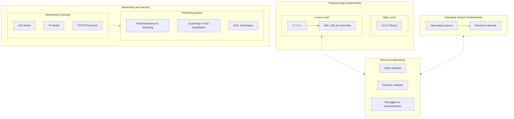

<strong> Roadmap </strong>

{: .warning}
> - Add this folder to your windows defender exclusions as it might remove valuable resources.
> - Don't jump from topic to topic unless you know what you're doing. Most of the "steps" build on top of each other.
> - Install add-ons like [dark reader](https://darkreader.org/) and [remove HTML elements](https://chromewebstore.google.com/detail/remove-html-elements/enegojdnkeicfoiknhfjaedhlckeahmf?hl=en&pli=1) that make reading better.
> - If you really can't wrap your head around something, just ask [ChatGPT](https://chatgpt.com/) to clarify it.
> - Keep note of where you left off studying and make bookmarks in your browser application.
