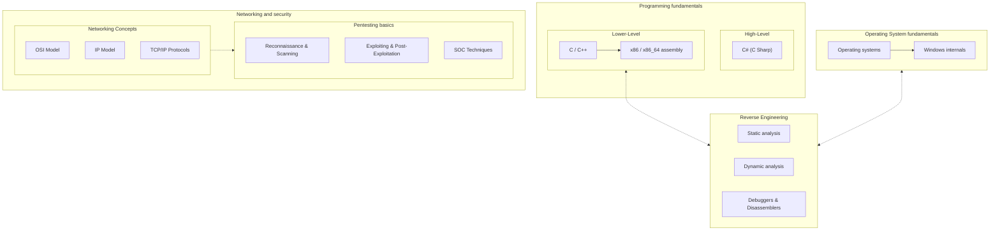

# How to study
## Study tips
When studying computer science, it's important to follow the **"natural progression"**. Some topics build on each other, meaning you can’t write something without knowing your ABCs, just like you can’t reverse software without understanding assembly and programming in general.

Some topics are standalone, as they have their own separate path but eventually connect somewhere down the line. These standalone topics usually lead to a more integrated understanding as you progress:

- Programming
- Networking and security

 Key Takeaways:
 
- Use spaced repetition (e.g., Anki) for memorization.
- Write summaries like these, in your own words to reinforce understanding.
- Don't jump from topic to topic unless you know what you're doing. Most of the "steps" build on top of each other.
- Every small "step" you take should be a small practical project, code base, or challenge.
- Keep note of where you left off studying.

## Roadmap

## Technical Tips

!!! tip
    - In case you are studying this using the raw GitHub files, add this folder to your Windows Defender exclusions as it might remove valuable resources.
    - Install add-ons like [Dark Reader](https://darkreader.org/) and [Remove HTML Elements](https://chromewebstore.google.com/detail/remove-html-elements/enegojdnkeicfoiknhfjaedhlckeahmf?hl=en&pli=1) to make reading better on supported webpages.
    - If you really can't wrap your head around something, just ask [ChatGPT](https://chatgpt.com/) or other AI to clarify it.
    - Make bookmarks of useful resources in your browser application.