# Networking today
## Components
### Hosts
A host is any computer or device connected to a network that communicates directly.

- Also called endpoint devices
- Some hosts act as clients, others as servers
- Each host is assigned an IP address, which:
  - Identifies the device (host)
  - Identifies the network it belongs to

### Servers
Computers with software that allow them to provide information,
like email or web pages,
to other end devices on the network.

- Each **service** needs its own **server software** (e.g., web service → web server software).
- A server can run multiple services at the same time.
- One server can serve many clients simultaneously.

### Clients
Clients have software for **requesting and displaying** the information obtained from the server.

- Use mailing client to access email from the server
- Use web client to access web pages from the server
- Use file client (like explorer) to access files from the server

### Peer-to-peer
Normally, client software and server software run on separate computers.

A single computer can act as both client and server:
- Advantages:
  - Easy to set up
  - Less complex
  - Lower cost because network devices and dedicated servers may not be required
  - Can be used for simple tasks such as transferring files and sharing printers
- Disadvantages:
  - No centralized administration
  - Not as secure
  - Not scalable
  - All devices may act as both clients and servers which can slow their performance


### Endpoint devices
An end device is either the **source or destination of a message** transmitted over the network.

### Intermediary devices
- Connect the individual end devices
- Connect multiple individual networks
- Use the **destination address + network info to decide the best path** for messages through the network.

Perform device actions:
- Regenerate and retransmit communication signals
- Maintain information about what pathways exist through the network and internetwork
- Notify other devices of errors and communication failures
- Direct data along alternate pathways when there is a link failure
- Classify and direct messages according to priorities
- Permit or deny the flow of data, based on security settings

### Network media
**Transmits** communication across a network.
Media provides the **channel** over which the message transmits.

Modern networks primarily use three types:
- Metal wires within cables (copper) - Data is encoded into electrical impulses.
- Glass or plastic fibers within cables (fiber-optic cable) - Data is encoded into pulses of light.
- Wireless transmission - Data is encoded via modulation of specific frequencies of electromagnetic waves.

The four main criteria for choosing network media are these:
- Maximum signal carry distance
- Installation environment
- Data amount / speed
- Costs

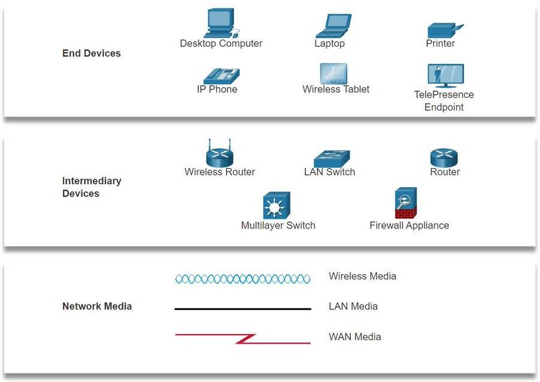

## Representation & topologies
### Representations
A diagram provides an easy way to understand how devices connect in a large network.
This type of “picture” of a network is known as a **topology diagram**.
In addition to these representations, specialized terminology is used,
to describe how each of these devices and media connect to each other:
  - **Network Interface Card (NIC)** - A NIC physically connects the end device to the network.
    - Has its own **MAC** address.
  - **Physical Port** - A connector or outlet on a networking device where the media connects to an end device or another networking device.
    - A **connector** (hole/slot) you can plug a cable into.
    - Exists on NICs, switches, routers, etc.
  - **Interface or port** - Specialized ports on a networking device that connect to individual networks. Because routers connect networks, the ports on a router are referred to as network interfaces.
    - A **port with configuration + logical meaning** in networking.

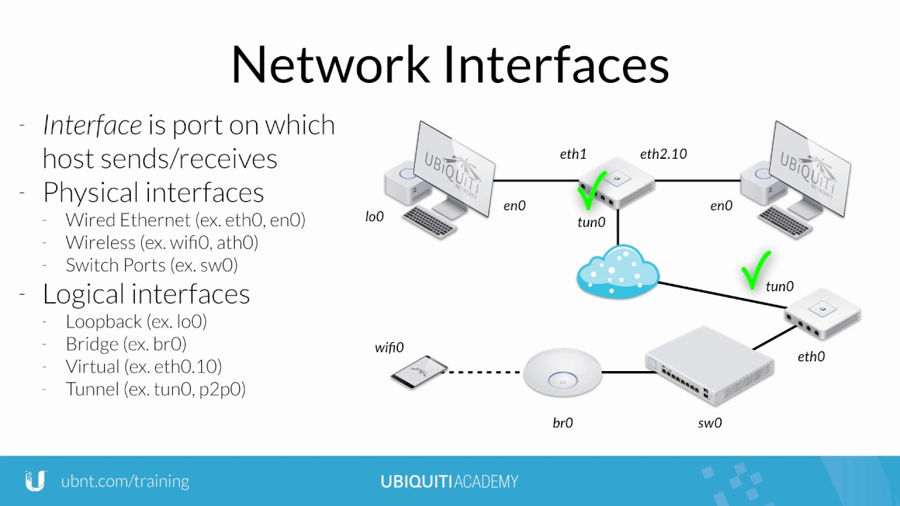

### Topology diagrams
Mandatory **documentation** for anyone working with a network.
- **Visual** map of how the network is connected.
- There are two types of topology diagrams:
  - Physical
  - Logical

#### Physical topology diagrams
Physical topology diagrams illustrate the physical location of intermediary devices and cable installation:
- Room
- Rack
- Shelf

#### Logical topology diagrams
Logical topology diagrams illustrate how data flows in the network:
- Devices
- Ports
- Addressing scheme
- Media


## Common types of networks
### Home networks
- Connect a few devices
- Share printers, files, pictures, music
- Example: a single cabinet with a monitor on one shelf, a pc and a printer on the other.

### SOHO (Small Office / Home Office)
- Support remote work & small businesses
- Used for advertising, sales, ordering, customer communication
- Example: two desks with one shared printer, each a monitor, phone and computer.

### Business / Enterprise networks
- Centralize **storage & access on servers**
- Provide **email, messaging, collaboration**
- Connect to the internet to deliver products/services
- Example: Multiple floors, each equipped with essential endpoint devices.

### The internet
- Largest network = **“network of networks”**
- Combines **public and private** networks

Worldwide collection of **interconnected networks** (internetworks, or internet for short):
- Not owned by any individual or group, combines **public and private** networks

Effective communication requires:
- **Common technologies and standards**
- Cooperation among **network administration agencies**

Key organizations maintaining Internet standards:
- IETF (Internet Engineering Task Force) – develops protocols and standards
- ICANN (Internet Corporation for Assigned Names and Numbers) – manages domain names and IP addresses
- IAB (Internet Architecture Board) – oversees Internet architecture and protocols

### Peer-to-Peer (P2P)
In homes/small businesses, devices act as **both clients & servers**.

### LANs & WANs
Network infrastructures vary greatly in terms of:
- Size / Area covered
- Number of users
- Number / types of services
- Area of responsibility

The two most common types of network infrastructures are **Local Area Networks** (LANs),
and **Wide Area Networks** (WANs):
- A LAN is typically used in a department within an enterprise, a home, or a small business network.
- A WAN is a network infrastructure that provides access to other networks over a wide geographical area, which is typically owned and managed by a larger corporation or a telecommunications service provider.

#### LAN
Network infrastructure that spans a **small geographical area**.

- LANs interconnect end devices in a limited area such as a home, school, office building, or campus.
- Usually administered by a single organization or individual. Administrative control is enforced at the network level and governs the security and access control policies.
- High-speed bandwidth to internal end devices and intermediary devices.

#### WAN
Network infrastructure that spans a **wide geographical area**.
WANs are typically managed by **service providers (SPs)** or **Internet Service Providers (ISPs)**.

- Interconnect LANs over wide geographical areas such as between cities, states, provinces, countries, or continents.
- WANs are usually administered by multiple service providers.
- WANs typically provide slower speed links between LANs.

### Intranets and extranets
#### Intranet
Intranet is a term often used to refer to a **private connection of LANs and WANs** that belongs to an organization.
An intranet is designed to be **accessible only by the organization's members**, employees, or others with authorization.

#### Extranet
Extranet to provide secure and safe **access to individuals who work for a different organization but require access** to the organization’s data.
- A company that is providing access to outside suppliers and contractors
- A hospital that is providing a booking system to doctors so they can make appointments for their patients
- A local office of education that is providing budget and personnel information to the schools in its district

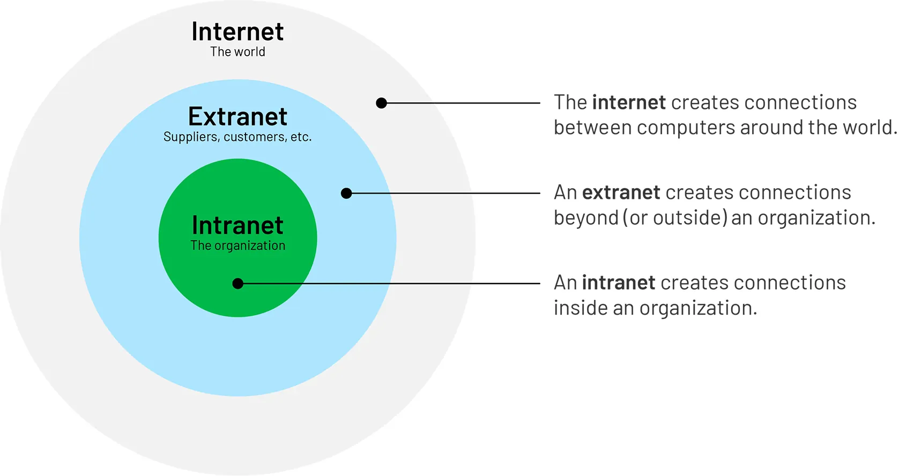

## Internet connections & access technologies
### SOHO vs. Enterprise 
#### SOHO
- Connect via an **ISP** through common connection types:
  - **DSL (Digital Subscriber Line)** = telephone lines (ADSL)
  - Coaxial cable = television lines
  - Cellular / mobile services = cell phone networks
  - Satellite = satellite dishes, useful in remote areas
  - Dial-up telephone = any phone line + modem

#### Enterprise
- Connect through **service providers (SPs)** using:
  - Dedicated leased line = private fiber or copper lines
  - Business DSL = SDSL
  - Metro Ethernet = WAN
  - Satellite

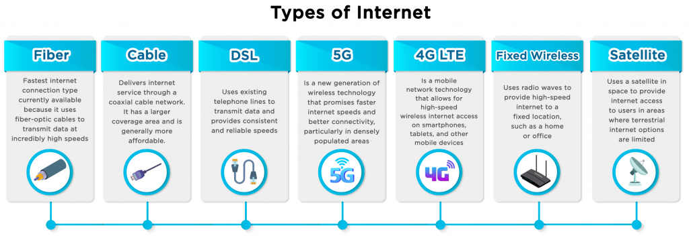

### The converging network
In the past, data, telephone,
and video **each had their own physical network lines**.
They used different technologies and standards,
so they couldn’t interoperate.
Result: more cables, more equipment, higher cost — one network per service.

Today, a single IP-based network carries data, voice, and video together.
All services follow the same rules (protocols like IP) and share the same infrastructure.
Result: simpler design, lower cost, easier management — many services on one network.

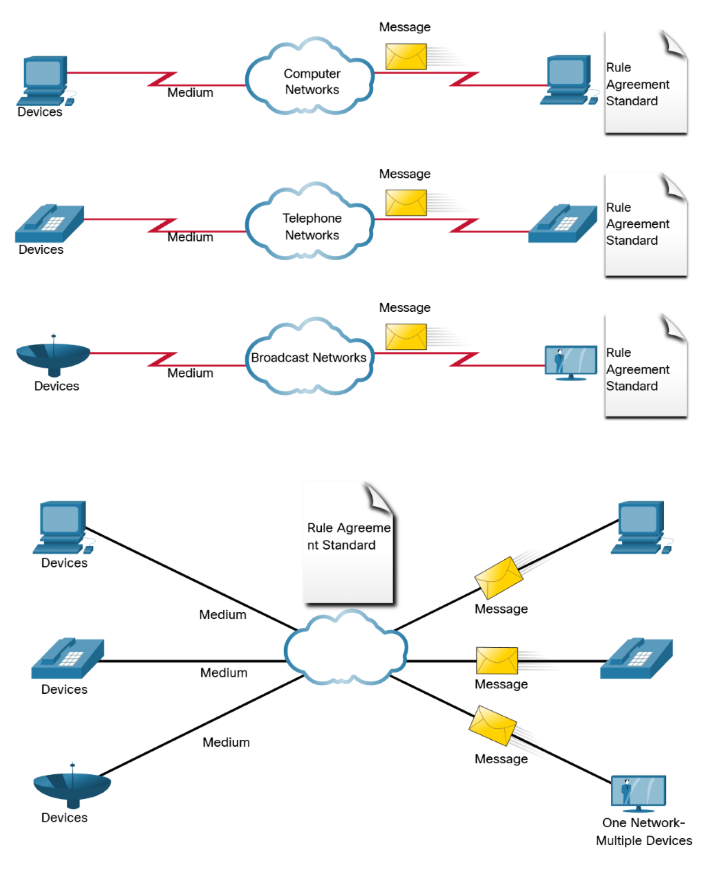

## Reliable networks
### Network reliability & architecture
Network Architecture defines:
- The infrastructure **technologies**
- The **protocols** that move data across the network

Four key characteristics for reliability:
1. **Fault Tolerance** – network continues working despite failures
2. **Scalability** – can grow as user/device needs increase
3. **Quality of Service (QoS)** – ensures performance for critical applications
4. **Security** – protects data, devices, and access

#### Fault Tolerance = redundancy
Limits the number of devices affected during a failure and allows **quick recovery**.

**Redundancy & packet-switched networks**:
- Multiple paths between source and destination, if one fails, traffic uses another path.
- Routers dynamically choose paths based on network conditions. Packets of the same message may take different paths, but the user is unaware


#### Scalability
Can grow to support new users and applications without reducing performance for existing users.

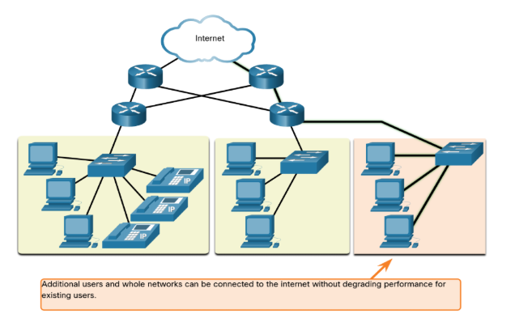

#### Quality of Service (QoS)
The network’s ability to prioritize important traffic so critical applications get the bandwidth,
low latency, and reliability they need.

- Classifies traffic (voice, video, data)
- Prioritizes critical traffic over less important traffic
- Controls bandwidth, delay, jitter, and packet loss

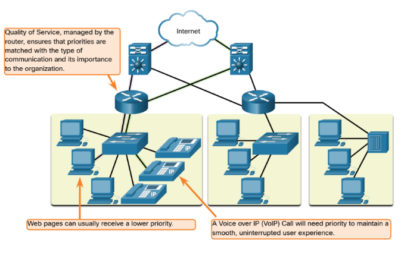

#### Security
Networks, services, and data are **critical personal and business assets**.

Two main concerns:
1. Network Infrastructure Security:
   - Physically secure devices (switches, routers, servers)
   - Prevent unauthorized access to management software on devices

2. Information Security
   - Protect the data stored on network-attached devices

#### Information security requirements, The CIA triad
The CIA triad:
- **Confidentiality**: Only authorized recipients can access and read data
- **Integrity**: Data is not altered during transmission from source to destination
- **Availability**: Authorized users have timely and reliable access to data and services


## Network trends
### BYOD
Users connect any device of their own, anywhere, for any purpose to the network.
This could be laptops, notebooks, tablets, smartphones, e-readers, etc.

Ownership is **personal or enterprise**!

**Key point:** BYOD gives users flexibility, but requires careful network security and management.

### Online collaboration
Working with others on joint projects using network tools.

- instant messaging
- image sharing
- video sharing
- link sharing
- post history
- team spaces

**Key point:** Collaboration tools rely on the network to connect people and resources in real time.

### Video communications
Used for communication, collaboration, and entertainment.

- video calls
- video conferencing

**Key point:** Video communications rely on networks to connect people in real time, enhancing collaboration.

### Cloud computing
Access and store data, run applications, and backup drives on remote servers via the internet.

Benefits for businesses:
- Extend IT capabilities without buying new infrastructure or software
- On-demand, accessible anywhere, cost-effective, secure

Data Centers:
- Facilities that house computers, storage, and networking components
- Can be small (one room) or large (warehouse-sized)
- Large organizations may build private data centers, smaller organizations lease cloud services

**Key point:** Cloud computing allows flexible, scalable,
and cost-effective access to resources without owning physical infrastructure.

#### 4 Types of cloud
1. **Public Cloud**, services available to the general public
2. **Private Cloud**, exclusive to one organization
3. **Hybrid Cloud**, mix of public and private clouds
4. **Community Cloud**, shared by several organizations with similar needs


### Smart homes
Everyday appliances and devices are connected to the network to become automated and “smart”.

**Key point:** Smart homes rely on networks to connect and automate devices for convenience and efficiency.

### Powerline networking
Uses existing electrical wiring in a home to connect network devices.

**Key point:** Powerline networking provides a practical alternative for home network connectivity when Wi-Fi or Ethernet cabling is insufficient.

### Wireless broadband
Connect homes and small businesses to the internet **where cable or DSL is unavailable**.

**Key point:** Wireless broadband provides internet access without physical cables,
ideal for remote areas or flexible setups.

## Network security
### Threats
Internal:
- Employees
- Lost / stolen devices
- BYOD increases vulnerability

External:
- **Viruses, worms, Trojan horses** – malicious software running on devices
- **Spyware and adware** – secretly collect user information
- **Zero-day attacks** – exploit vulnerabilities on the first day discovered
- **Threat actor attacks** – malicious individuals targeting devices or networks
- **Denial of Service (DoS)** – slow down or crash network applications
- **Data interception/theft** – steal private information
- **Identity theft** – steal login credentials to access private data

### Solutions
Layered Security:
- No single solution is enough, multiple layers protect against different threats
- If one layer fails, others can still prevent breaches

SOHO solutions:
- Anti-virus / anti-spyware
- Firewall filtering

Complete network solutions:
- Dedicated firewalls, advanced traffic filtering
- Access Control Lists (ACLs), traffic filtering by IP or apps
- Intrusion Prevention Systems (IPS), detect spreading attacks
- Virtual Private Networks (VPNs), secure remote access

Key point: Effective network security requires a **multi-layered approach** tailored to the environment and applications.

# Switch & end-point config
## Cisco IOS Access
### Cisco operating systems
- **Cisco IOS**: Standard OS for many Cisco routers and switches. Different device types may use different IOS versions.
- Other Cisco OS variants: IOS XE, IOS XR, NX-OS.
- Home routers: Usually run “**firmware**” and are often configured via **web browser-based GUI**.

### Access methods
A switch will forward traffic by default and does not need to be explicitly configured to operate. Regardless of the default behavior of a new switch, **all switches should be configured and secured**.

Two access methods:
- **Out-of-band access:** direct line, physical console
  - Console port
- **In-band access:** indirect line over the network
  - SSH
  - Telnet
  - Terminal emulators

### Terminal emulators
Commonly these are GUI's or CLI's used to connect through out-of-band methods.
Examples include: PuTTY, Tera Term, SecureCRT, HyperTerminal, Minicom.

## Cisco IOS navigation
### Primary command modes
Cisco IOS software separates management access into the following two command modes:

- `User-EXEC mode`: a **limited view-only monitoring mode**, useful for basic operations. Identified by the `>` symbol.
- `Privileged-EXEC mode`: an **unlimited** mode. Identified by the `#` symbol.

### Configuration and subconfiguration modes
To configure a device we must enter **global configuration mode** from privileged-exec mode.
Identified by a prompt that ends with `(config)#` after the device name, such as `Switch(config)#`.

From global config mode, the user can enter different subconfiguration modes.

Two common subconfiguration modes include:
- `Line Configuration Mode`, `Switch(config-line)#`: Used to configure console, SSH, Telnet, or AUX access.
- `Interface Configuration Mode`, `Switch(config-if)#`: Used to configure a switch port or router network interface.

### Navigating modes
| From                 | To                      | Example                                                                         | Output                 |
|----------------------|-------------------------|---------------------------------------------------------------------------------|------------------------|
| User-EXEC            | Privileged-EXEC         | `enable`                                                                        | `Switch#`              |
| Privileged-EXEC      | User-EXEC               | `disable`                                                                       | `Switch>`              |
| Privileged-EXEC      | Global-configuration    | `configure terminal`                                                            | `Switch(config)#`      |
| Global-configuration | Privileged-EXEC         | `exit`                                                                          | `Switch#`              |
| Global-configuration | Line-configuration      | `line <console, vty, aux> <number> <range min.> <range max.>`, `line console 0` | `Switch(config-line)#` |
| Global-configuration | Interface-configuration | `interface <type> <slot/port>`, `interface FastEthernet 0/1`                    | `Switch(config-if)#`   |
| Line-configuration   | Global-configuration    | `exit`                                                                          | `Switch(config)#`      |
| Any subconfiguration | Privileged-EXEC         | `end` or `Ctrl+Z`                                                               | `Switch#`              |

## Command structures
### Syntax


### IOS help features
The IOS has two forms of help available.

**Context-sensitive help**, used by entering a `?`:
- Which commands are available in each command mode?
- Which commands start with specific characters or group of characters?
- Which arguments and keywords are available to particular commands?

Examples:
- `interface ?`, fetch all interface commands
- `I ?`, fetch all commands starting with an "I"

**Command-syntax check**, used automatically:
- Verifies if the command entered was valid
- Provides feedback describing what is wrong with the command

### Hot keys & shortcuts
The configure command can be **shortened** to `conf` because configure is the only command that begins with conf.

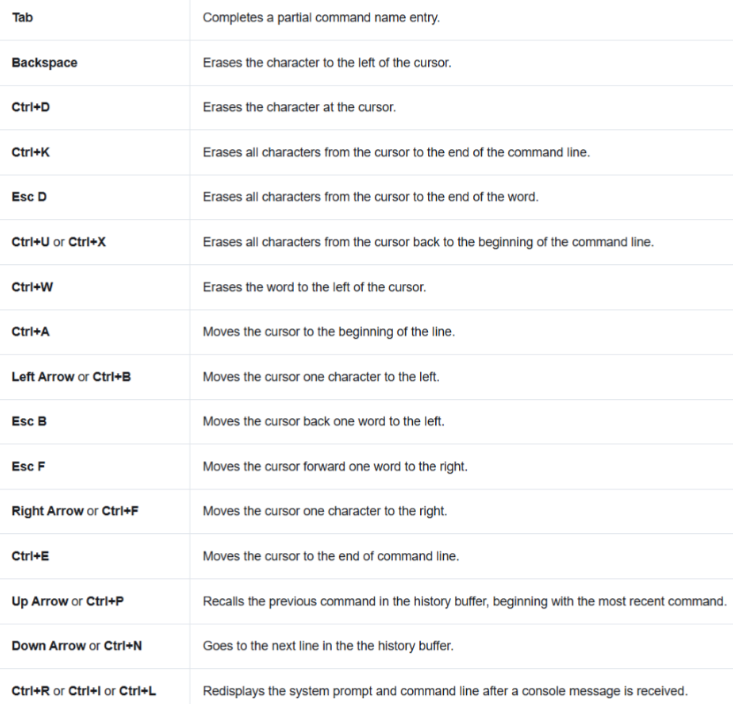

When a command output produces more text than can be displayed in a terminal window,
the IOS will display a **“--More--”** prompt.
The following table describes the keystrokes that can be used when this prompt is displayed.


## Basic device configuration
### Hostnames & configuring hostnames
By default a Cisco IOS switch name is **"Switch."**
We rename a device with a unique hostname for **easier identification**.

Here are some important **naming guidelines** for hosts:
- Start with a letter
- Contain **no spaces**
- End with a letter or digit
- Use **only letters, digits, and dashes**
- Be less than 64 characters in length

Configuration:
```terminaloutput
Switch> enable
Switch# configure terminal 
Switch(config)# hostname Sw-Floor-1
Sw-Floor-1(config)#
Sw-Floor-1(config)# exit
Sw-Floor-1#
Sw-Floor-1# disable
Sw-Floor-1>
```

### Password guidelines
Cisco IOS can be configured to use **hierarchical mode passwords**,
it allows different access privileges to a network device.

All networking devices should limit administrative access by securing following modes:
- privileged-EXEC
- user-EXEC
- remote Telnet access
- In addition, all passwords should be encrypted and legal notifications provided.

Key points for choosing passwords:
- At least eight characters in length
- A combination of upper and lowercase letters, numbers, special characters, and/or numeric sequences
- Unique passwords for each device, avoid reusing them
- Do not use common words

### Configuring passwords
We can only configure passwords in the **console config submode**.

#### Securing console access
```terminaloutput
Sw-Floor-1> enable
Sw-Floor-1# config terminal
Sw-Floor-1(config)# line console 0
Sw-Floor-1(config-line)# password Test123
Sw-Floor-1(config-line)# login
Sw-Floor-1(config-line)#
```

`login`, tells the device to ask for this password when someone tries to log in:
```terminaloutput
Sw-Floor-1 con0 is now available
Press RETURN to get started.
User Access Verification
Password: 

Sw-Floor-1>
```

#### Securing Privileged-EXEC mode
Using `enable secret <string>` is better than using `password <string>`,
because it encrypts the password.

```
Sw-Floor-1> enable
Sw-Floor-1# config terminal
Sw-Floor-1(config)# enable secret SuperTest123
```
There's **NO** need for the `login` command here:
```terminaloutput
Sw-Floor-1 con0 is now available
Press RETURN to get started.
User Access Verification
Password:
 
Sw-Floor-1> enable
Password: 
Sw-Floor-1#
```

#### Securing VTY lines (Telnet/SSH remote access)
VTY (**Virtual** Teletype) lines are logical, **software-based** interfaces on network devices.

We can see the amount of virtual teletype lines by using `line vty ?`.

```terminaloutput
Sw-Floor-1 con0 is now available
Press RETURN to get started.
User Access Verification
Password: 

Sw-Floor-1> enable
Password: 
Sw-Floor-1# config terminal
Sw-Floor-1(config)# line vty 0 15
Sw-Floor-1(config-line)# password Test1234
Sw-Floor-1(config-line)# login
Sw-Floor-1(config-line)# exit
Sw-Floor-1(config)# exit
Sw-Floor-1# disable
Sw-Floor-1> exit
```

### Encrypting passwords
Only the command: `Enable secret <string>` in privileged-EXEC mode uses md5 encryption by default.
ALL other passwords are saved in `startup-config` and `running-config` files.
Even worse, ALL these other passwords are saved in **plaintext**.

The `service password-encryption` command encrypts all passwords.

The command applies **weak encryption** to all unencrypted passwords. This encryption applies **only to passwords in the configuration files**, not to passwords as they are sent over the network.

```terminaloutput
Sw-Floor-1 con0 is now available
Press RETURN to get started.
User Access Verification
Password: 

Sw-Floor-1> enable
Password: 
Sw-Floor-1# config terminal
Sw-Floor-1(config)# service password-encryption
```

### Device banner messages
This adds output similar to a message-of-the-day type output.

Banners can be an important part of the legal process,
in the event that someone is prosecuted for breaking into a device.
Some legal systems do not allow prosecution,
or even the monitoring of users, unless a notification is visible.

```terminaloutput
Sw-Floor-1> enable
Sw-Floor-1# conf t
Sw-Floor-1(config)# banner motd "ACCESS IS FOR AUTHORIZED PERSONNEL ONLY"
```

### `show` & verifying configurations
With the `show` command we can show configurations.

It's important to verify configurations using the `show running-config`,
and optionally the `show startup-config` commands.

## Managing configurations
### Configuration files
There are two system files that store the device configuration:
- `startup-config`: Stored in NVRAM (Non-volatile Random Access Memory).
  - Flash does not lose its contents when the device is powered off.
  - Contains all the commands that will be used by the device upon startup or reboot. 
  - NVRAM usually stores basic I/O configuration on an OS

- `running-config`: Stored in RAM ((Volatile) Random Access Memory).
  - It reflects the current configuration.
  - Modifying a running configuration affects the operation of a Cisco device immediately.
  - Loses all of its content when the device is powered off or restarted.

### Saving or overwriting configurations
Use `copy running-config startup-config` to save changes from the running configuration to the startup configuration file.
You can also overwrite the `running-config` if you're unhappy with the current changes by using `copy startup-config running-config`

```terminaloutput
Sw-Floor-1# conf t
Sw-Floor-1(config)# hostname TEST
TEST(config)# exit
TEST# copy startup-config running-config 
Destination filename [running-config]? 
1105 bytes copied in 0.416 secs (2656 bytes/sec)

Sw-Floor-1#
```

### Restoring or clearing configurations
`running-config` (a.k.a. unsaved changes):
```terminaloutput
Sw-Floor-1> enable
Password: 
Sw-Floor-1# reload
System configuration has been modified. Save? [yes/no]:no
Proceed with reload? [confirm]
Switch>
```

`startup-config` (a.k.a. saved changes):
```terminaloutput
Sw-Floor-1> enable
Sw-Floor-1# erase startup-config 
Erasing the nvram filesystem will remove all configuration files! Continue? [confirm]
[OK]
Erase of nvram: complete
%SYS-7-NV_BLOCK_INIT: Initialized the geometry of nvram
Sw-Floor-1# reload
Proceed with reload? [confirm]

Switch>
```

### Saving configurations to a text file through at VTY line
1. Connect to the device:
    - Use terminal software (PuTTY, Tera Term) connected to the switch/router.
2. Enable session logging:
    - In the terminal software, turn on logging.
    - Assign a file name and location (e.g., MySwitchLogs.txt).
    - All CLI output will be saved to this file.
3. Display the configuration:
    - At the privileged EXEC prompt, type:
    - show running-config
    - Show startup-config
    - The text that appears in the terminal will be saved to your log file
4. Disable logging:
    - Stop session logging in the terminal software (e.g., select “None” for session logging).

### Restoring configurations from a text file
1. Enter global configuration mode on the device:
   - Configure terminal
2. Apply saved configuration
   - Open your saved text file
   - Copy and paste the commands directly into the terminal window
   - copy running-config startup-config

## Ports and addresses
### IP adresses
Purpose: allow devices to **find each other** and communicate end-to-end on a network or the internet.

IPv4:
- Length: **32 bits** → represented by **4 decimal numbers**
- Format: Dotted decimal notation → four numbers between 0–255: `192.168.1.10`
- Subnet Mask: 32-bit value **separating network vs host portions**: `255.255.255.0`
  - 1s in the mask verify the **network portion** → `192.168.1`
  - 0s in the mask verify **host portion** → `.10`

IPv4 binary example:
IP:     11000000.10101000.00000001.00001010
Mask:   11111111.11111111.11111111.00000000

Default Gateway:
- The router IP used to reach remote networks
  - 192.168.1.1

We need all of these portions: IPv4 address,
subnet mask and default gateway to let a device communicate locally and remotely.

IPv6:
- Length: **128 bits** → represented by **32 hexadecimal digits**
- Format: 8 groups of 4 hex digits separated by colons: `2001:0db8:85a3:0000:0000:8a2e:0370:7334`

### Interfaces and ports
Every device (PC, switch, router) uses interfaces (physical or virtual) to connect to media.
Not every interface supports the same media (Ethernet vs fiber vs wireless).

- Media = the wires/waves carrying data.
- Interfaces = the data connection points (physical or virtual) between devices and media.
- Switch SVIs = special virtual ports that let you assign IPs for remote management.

## Configuring IP addressing
### Manual IP configuration on end-devices
IPv4 address information can be entered into end devices manually,
or automatically using **Dynamic Host Configuration Protocol (DHCP)**.

Use `ipconfig` on a Windows device to look at the host's configuration.

Note: The **DNS server addresses** are the IPv4 and IPv6 addresses of the Domain Name System (DNS) servers, 
which are used to **translate IP addresses to domain names**.

### Automatic IP configuration on end-devices
End **devices typically default to using DHCP** for automatic IPv4 address configuration.
DHCP enables automatic IPv4 address configuration for every end device that is DHCP-enabled.

### Switch virtual interface configuration
A `Switch Virtual Interface (SVI)` is a Layer-3 interface on the switch (e.g. interface vlan 10).
While configuring the `SVI` we provide the switch with an **IP address and subnet mask** so that it's reachable over the network.

Create/activate the SVI (VLAN 1):
```terminaloutput
Sw-Floor-1#conf t
Sw-Floor-1(config)# interface ?
  Ethernet         IEEE 802.3
  FastEthernet     FastEthernet IEEE 802.3
  GigabitEthernet  GigabitEthernet IEEE 802.3z
  Port-channel     Ethernet Channel of interfaces
  Vlan             Catalyst Vlans
  range            interface range command
Sw-Floor-1(config)# interface vlan 1
Sw-Floor-1(config-if)#ip address 10.10.10.10 255.255.255.0
Sw-Floor-1(config-if)#no shutdown
%LINK-5-CHANGED: Interface Vlan1, changed state to up
Sw-Floor-1(config-if)# exit
Sw-Floor-1(config)# ip default-gateway 10.10.10.1
Sw-Floor-1(config)# exit
Sw-Floor-1# copy running-config startup-config 
Destination filename [startup-config]? 
Building configuration...
[OK]
```

## Verify connectivity
There's multiple things we could do:
1. On hosts
   - use `ipconfig` → Did the PC get the right IP, mask, gateway?
   - use `ping <ip-address>` between PCs on the same network → checks local connectivity
   - use `ping <ip-address>` from a PC to the switch/router’s SVI → checks gateway reachability
2. On switches & routers `show ip interface brief` → Are interfaces up/up and with the correct IPs
3. Later, when routers are in play: `ping` across networks → checks end-to-end.

`show ip interface brief` shows us the Vlan1 IP on the switch:
```terminaloutput
Sw-Floor-1# show ip interface brief 
Interface              IP-Address      OK? Method Status                Protocol 
FastEthernet0/1        unassigned      YES manual down                  down 
FastEthernet0/2        unassigned      YES manual down                  down 
FastEthernet0/3        unassigned      YES manual down                  down 
FastEthernet0/4        unassigned      YES manual down                  down 
FastEthernet0/5        unassigned      YES manual down                  down 
FastEthernet0/6        unassigned      YES manual down                  down 
FastEthernet0/7        unassigned      YES manual down                  down 
FastEthernet0/8        unassigned      YES manual down                  down 
FastEthernet0/9        unassigned      YES manual down                  down 
FastEthernet0/10       unassigned      YES manual down                  down 
FastEthernet0/11       unassigned      YES manual down                  down 
FastEthernet0/12       unassigned      YES manual down                  down 
FastEthernet0/13       unassigned      YES manual down                  down 
FastEthernet0/14       unassigned      YES manual down                  down 
FastEthernet0/15       unassigned      YES manual down                  down 
FastEthernet0/16       unassigned      YES manual down                  down 
FastEthernet0/17       unassigned      YES manual down                  down 
FastEthernet0/18       unassigned      YES manual down                  down 
FastEthernet0/19       unassigned      YES manual down                  down 
FastEthernet0/20       unassigned      YES manual down                  down 
FastEthernet0/21       unassigned      YES manual down                  down 
FastEthernet0/22       unassigned      YES manual down                  down 
FastEthernet0/23       unassigned      YES manual down                  down 
FastEthernet0/24       unassigned      YES manual down                  down 
GigabitEthernet0/1     unassigned      YES manual down                  down 
GigabitEthernet0/2     unassigned      YES manual down                  down 
Vlan1                  10.10.10.10     YES manual up                    down
```

`ping` example to the switch Vlan1 IP:
```terminaloutput
C:\>ping 10.10.10.10

Pinging 10.10.10.10 with 32 bytes of data:

Reply from 10.10.10.10: bytes=32 time<1ms TTL=255
Reply from 10.10.10.10: bytes=32 time<1ms TTL=255
Reply from 10.10.10.10: bytes=32 time<1ms TTL=255
Reply from 10.10.10.10: bytes=32 time<1ms TTL=255

Ping statistics for 10.10.10.10:
    Packets: Sent = 4, Received = 4, Lost = 0 (0% loss),
Approximate round trip times in milli-seconds:
    Minimum = 0ms, Maximum = 0ms, Average = 0ms
```

# Protocols & Models
## Rules
Simply having two or more devices connected is not enough.
They must know how to communicate.

### Protocols & models
Protocols are **standardized rule sets created by organizations** to ensure different network devices and systems (like Apple and Windows computers) can communicate with each other.
Because many protocols exist for different types of communication,
network engineers use models to abstract and visualize how these rules work together.

### Fundamentals of communication
All communication methods have the following in common:
- **Message source (sender):** A person, device or other in need of sending a message.
- **Message destination (receiver):** A person, device or other receiving a message and interpreting it.
- **Channel:** The media channel that provides a path for the message to travel over from source to destination.

### Protocol requirements
In addition to identifying the source and destination, computer and network protocols define the details of how a message is transmitted across a network:
- Message encoding
- Message formatting and encapsulation
- Message size
- Message timing
- Message delivery options

#### Encoding
Encoding is the process of converting information into another acceptable form,
for transmission.
**Decoding** reverses this process to interpret the information.

Example:
Messages sent across the network are first converted into bits by the sending host.
Each bit is encoded into a pattern of voltages on copper wires,
infrared light in optical fibers, or microwaves for wireless systems.
The destination host receives and decodes the signals to interpret the message.

#### Formatting
When a message is sent from source to destination, it must use a specific format or structure.
Message formats depend on the type of message and the channel that is used to deliver the message.

Think of formatting as structuring a letter or a sentence:
- You include a sender address, receiver address, and message body.
- If you don’t format it properly, the post office can’t deliver it.
- If your sentences are not in the correct order, the receiver can’t read it.

In networking, each protocol (like IP, TCP, Ethernet, etc.) defines how its messages are formatted:
- What fields are included
- What order they appear in
- How big each field is (in bits or bytes)

Example of an IPv4 packet:
- Version
- Header length
- Total length
- Source IP
- Destination IP
- Data

#### Encapsulation
Encapsulation happens when data moves down the OSI or TCP/IP model.
Each layer adds its own “header” (and sometimes a “trailer”) around the data.

You can imagine it like nesting envelopes:
- You write a message → put it in an envelope → then a bigger envelope → then a box, etc.
- Each layer adds information the next layer below needs to do its job.

Remember:
- **Encapsulation** happens when data travels from top to bottom of the OSI or TCP/IP model (Application → Physical).
- **Decapsulation** happens when data travels from bottom to top (Physical → Application). Each layer removes its own header/trailer.

Example of sending an email:
```terminaloutput
Application data
    ↓
[Transport header] + Data → "Segment"
    ↓
[Network header] + Segment → "Packet"
    ↓
[Data link header & trailer] + Packet → "Frame"
    ↓
Frame converted to bits → "Bits" (sent on wire)
```

In short: data is progressively wrapped with layer-specific information as it moves from, 
**Data → Segment → Packet → Frame → Bits**.

#### Size
Because **frames have size limits**,
a large message is **split** into smaller pieces,
each sent in its own frame with **its own addressing information**.
At the destination, these pieces are **reassembled to reconstruct the original message**.

#### Timing
Message timing is also very important in network communications:
- `Flow control`: managing the **rate of data transmission**. The rate is the amount and the speed at which messages can be delivered.
- `Response timeout`: Hosts on the network use network protocols that **specify how long to wait for responses** and what action to take if a response timeout occurs. A response timeout occurs when the receiver didn't respond in time.
- `Access method`:  This determines **when a device is allowed to send data on a shared network medium**. In networks where multiple devices share the same physical channel (like Ethernet or Wi-Fi), access methods **prevent data collisions** and coordinate transmissions.

#### Delivery options
Network communications has similar delivery options to communicate. There three types of data communications include:
- **Unicast**, information is being transmitted to a **one single** end device.
- **Multicast**, information is being transmitted to a **one or more** end devices.
- **Broadcast**, information is being transmitted to **all** end devices.


## Protocols
### Functions
- **Addressing**: Identifies the sender and intended receiver so data reaches the correct device.
- **Reliability**: Ensures data is delivered successfully, even if packets are lost or corrupted (e.g., TCP).
- **Flow Control**: Regulates the rate of data transmission to prevent overwhelming the receiver.
- **Sequencing**: Numbers data segments so they can be reassembled in the correct order.
- **Error Detection**: Detects whether data was corrupted during transmission.
- **Application Interface**: Enables process-to-process communication between applications (e.g., HTTP/HTTPS for web traffic).

### Interaction
A message sent over a computer network typically **requires the use of several protocols**,
each one with its own functions and format.


## Protocol suites
A protocol suite is a **set of related protocols that work together** to enable network communication.
These protocols are often visualized as a stack of layers,
where each layer depends on the functionality of the one below it:
- Lower layers handle the physical transmission of data across the network.
- Upper layers focus on the content and meaning of the messages.

### Evolution of protocol suites
Since the **1970s**, multiple protocol suites have been developed,
some by standards organizations and others by vendors.

Several competing protocol suites emerged, including:
- TCP/IP
- OSI
- AppleTalk
- IPX/SPX (Novell NetWare)
- NetBIOS
- DECnet

**Result**:
- `TCP/IP` ultimately became the dominant protocol suite and is **used in modern networks**.
- The `OSI` model is now primarily **used as a conceptual and educational framework**.

### TCP/IP Suite
Today, the TCP/IP protocol suite uses many protocols and continuously evolves to support new services.

TCP/IP has two important aspects for vendors and manufacturers:
- **Open standard protocol suite**: Freely available to the public and can be used by any vendor.
- **Standards-based protocol suite**: Endorsed by the networking industry and approved by a standards organization.


## Standards Organizations (AI-generated summary)
### Open Standards (open-source & vendor-neutral)
- Purpose: Ensure interoperability between devices and software from different vendors
- Created by neutral organizations (not controlled by one company)
- Can define new protocols or standardize existing proprietary ones

**Key organizations**
- **IEEE**: Physical & data-link standards
    - Ethernet (802.3), Wi-Fi (802.11)
- **IETF**: Internet protocols
    - TCP/IP, HTTP, DNS, RFCs
- **ISO**: International standards
    - OSI model
- **ICANN**: Global coordination
    - Domain names, IP address allocation oversight
- **IANA**: Number assignments
    - IP addresses, port numbers, protocol IDs
- **ITU**: Global telecom standards
    - Phone, radio, Internet communications
- **ANSI**: U.S. standards coordination
- **TIA**: Telecom infrastructure
    - Cabling, data centers

### Internet Standards Organizations (TCP/IP-focused)
- **ISOC**: Promotes open Internet development worldwide
- **IAB**: Oversees Internet architecture and standards process
- **IETF**: Develops and maintains Internet protocols
    - Publishes **RFCs**
- **IRTF**: Long-term Internet research
    - Security, cryptography, P2P, anti-spam
- **ICANN**: Coordinates IP addressing and DNS globally
- **IANA**: Manages protocol numbers and address assignments (for ICANN)

### Electronic & Communications Standards
(Focus on how IP data is carried over physical media)

- **IEEE**: Networking & electronics standards
    - Ethernet (802.3), Wi-Fi (802.11)
- **EIA**: Physical infrastructure
    - Wiring, connectors, 19-inch equipment racks
- **TIA**: Telecom systems
    - VoIP, cellular, radio, satellite, cabling
- **ITU-T**: Global telecom standards
    - DSL, IPTV, video compression, broadband

### Quick Memory Aids
- **IEEE = wires & Wi-Fi**
- **IETF = Internet protocols**
- **ISO = models & frameworks**
- **ICANN/IANA = names & numbers**
- **TIA/EIA = physical infrastructure**
- **ITU-T = global telecom**

## OSI Reference model
**The Open System Interconnection (OSI)** reference model is used for:
- Protocol design
- Fostering competition because of the Open Standards Protocol Suite
- Providing a common language to describe networking functions and capabilities

Recap:
- The OSI model defines what must happen at each layer (theory and structure).
- The TCP/IP model defines how it actually happens using real protocols (implementation).

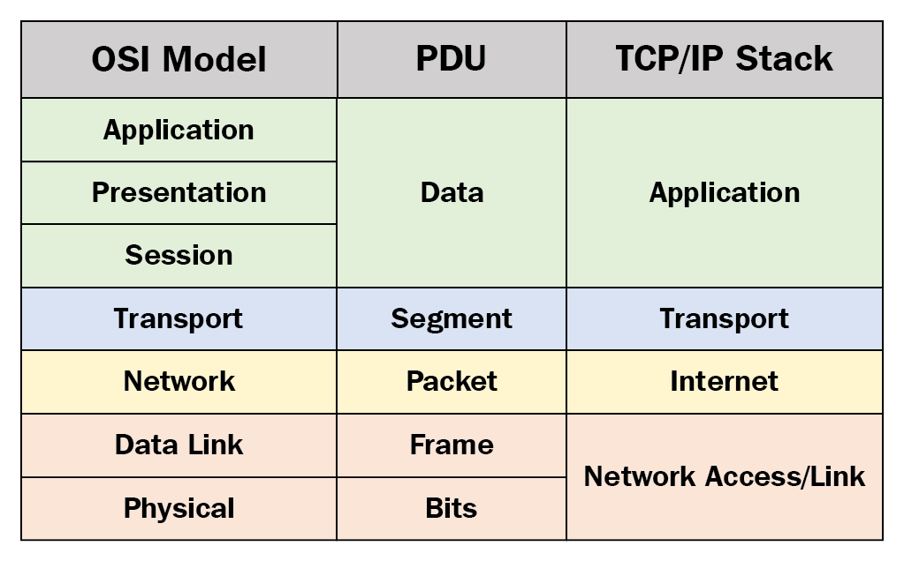

## Data encapsulation
### Segmentation and multiplexing
When data travels across a network, it isn’t sent as one continuous stream.
Instead, it’s **divided into smaller pieces** for efficiency and reliability.

Segmentation:
- The process of dividing large data streams into smaller units called **segments** or **packets**.
- Each packet is **sent separately** and **may take different paths** to the destination.

Benefits:
- Speed: Multiple communications can share the same network link at once (called **multiplexing**).
- Efficiency: If a packet is lost, **only that packet needs to be resent**, not the entire message.

### Sequencing
Dividing data into smaller segments adds complexity to network communication:
- Each segment must include **addressing and sequencing information** so the receiver can reassemble the original message correctly.
- **Segments can arrive out of order**, similar to sending a 100-page letter in 100 separate envelopes.
- The **TCP protocol manages this process**, it assigns sequence numbers and ensures all segments are correctly ordered and reassembled at the destination.

### Protocol Data Units
Each layer wraps the data from the layer above with its own control information (headers, sometimes trailers),
in a process known as **encapsulation**. A Protocol Data Unit or `PDU` is the result of encapsulation:
- Application layer: **Data**
- Transport layer: **Segment** (TCP) or Datagram (UDP)
- Network layer: **Packet** (or IP datagram)
- Data Link layer: **Frame**
- Physical layer: **Bits**

## Data Access
How does data move between devices on the same network or across different networks?

### Layer 3 – Network Layer Addresses (IP)
- Identify source and destination devices across networks
- Provide end-to-end packet delivery
- IP addresses remain the same from source to destination
- Decide whether the destination is local or remote
- **Decides where the data ultimately needs to go**

### Layer 2 – Data Link Layer Addresses (MAC)
- Identify source and destination NICs on the local network
- Deliver frames within a single network segment
- MAC addresses change at each hop
- Used to send data to the next-hop device (host or router)
- **Decides how to move the data to the next device right now**

# Physical layer
## The physical connection
A physical connection can be wired using a cable or wireless using radio waves.

We could even use the ethernet ports on a wireless router to make a wired connection to the wireless router.

### Network Interface Cards (NIC)
Network interface cards (NICs) **connect a device to the network**.
**Ethernet NICs** are used for a wired connection,
**wireless local area network (WLAN) NICs** are used for wireless.

A network printer, for example, may only have an Ethernet NIC,
and therefore, must connect to the network using an Ethernet cable.
Other devices, such as tablets and smartphones,
might only contain a WLAN NIC and must use a wireless connection.

### Wired ethernet NIC performance
Not all physical connections are equal,
in terms of the performance level, when connecting to a network.

## The physical layer characteristics
The physical layer consists of electronic circuitry,
media, and connectors developed by engineers.
Therefore, it is appropriate that the standards governing this hardware are defined by the relevant electrical and communications engineering organizations.
In addition to these, there are often **regional cabling standards groups** such as CSA (Canadian Standards Association),
CENELEC (European Committee for Electrotechnical Standardization),
and JSA/JIS (Japanese Standards Association), which develop local specifications.

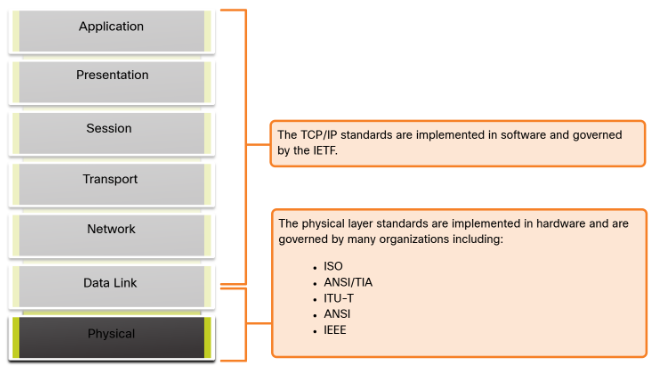

### Physical Components
The physical layer standards address three functional areas:
- Physical components
- Encoding
- Signaling

Physical components:
- electronic hardware devices
- Media
- NICs
- interfaces and connectors that transmit the signals that represent the bits
- cable materials
- cable designs

### (Line) encoding
Line encoding is the method for converting the digital data (bits) from the Data Link layer into a code or pattern of symbols that can be represented by physical signals.


### Signaling
Defines **how those encoded symbols are actually transmitted** as electrical, optical, or radio signals over the medium.

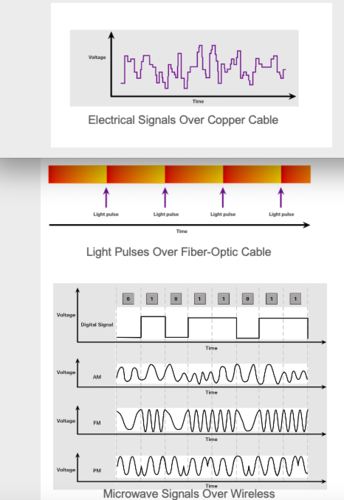

### Bandwidth
Different physical media support different **rates at which they transfer bits**,
this rate is commonly referred to as bandwidth.

- This makes bandwidth the **capacity** at which a medium can carry data.
- It's measured in: amount of **data per given amount of time**.
- Typically measured in kilobits per second (**kbps**), megabits per second (**Mbps**), or gigabits per second (**Gbps**).

#### Common confusions about bandwidth
Speed:
- Bandwidth is often mistaken for the **speed at which bits travel**, but this is incorrect.
- In both **10 Mbps and 100 Mbps Ethernet**, bits travel at roughly the **same physical speed** (the speed of electricity or light in the medium).
- The real difference is **how many bits are transmitted per second**, not how fast each bit moves.

Bits vs Bytes:
- Bits per second are **not the same** as bytes per second.
- **1 byte = 8 bits**
- Conversion example:
    - **1 Mbps** = 1,000,000 bits per second
    - = 125,000 bytes per second
    - = **0.125 MB/s**


#### Bandwidth terminology
Terms used to measure the **quality** of bandwidth include:
- Latency
- Throughput
- Goodput

**Latency**:
The amount of time, including delays, for data to travel from one given point to another.
Even if all, or most, of the segments have high bandwidth, it will only take one segment in the path with low throughput to create a bottleneck in the throughput of the entire network.
Usually represented in **ms**.

**Throughput**:
The measure of the transfer of bits across the media over a given period of time.
Usually represented in **Kbps, Mbps, Gbps**.

There are many factors that influence throughput:
- Amount of traffic
- Type of traffic
- Latency created by the number of network devices encountered between source and destination

**Goodput**:
The measure of **usable data** transferred over a given period of time.

Unusable data includes:
- establishing sessions
- acknowledgments
- encapsulation
- retransmitted bits

## Copper cabling
### Characteristics
There are three different types of copper cabling that are each used in specific situations.
Unshielded Twisted-Pair cable (**UTP**):
- Cheap, common
- Terminated with RJ-45 connectors
- 4 pairs of color-coded wires

Shielded Twisted-pair cable (**STP**):
- Expensive, anti-MFI & anti-RFI shielding
- Terminated with RJ-45 connectors
- 4 pairs of color-coded wires
- If the cable is improperly grounded, the shield **may act as an antenna and pick up unwanted signals**.

Coaxial cable:
- **Two conductors** share the same axis
- A copper conductor to transmet electronic signals
- A flexible plastic insulation layer around the conductor
- A woven copper braid or metallic foil, acts as second wire in the circuit as a shield for the inner conductor, also reduces outside electormagnetic interference
- Cable jacker to prevent minor physical damage

Connecetor types:
- The Bayonet Neill-Concelman (BNC)
- N type
- F type

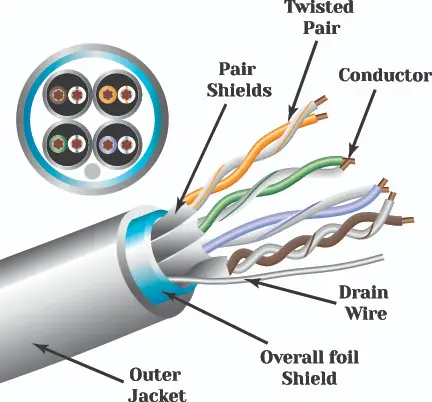

### Electromagnetic interference, radio frequency interference & crosstalk
Networks use copper media because it is inexpensive, easy to install,
and has low resistance to electrical current.
However, copper media is limited by **distance and signal interference**.
The farther the signal travels, the more it deteriorates.

The timing and voltage values of the electrical pulses are also susceptible to **interference** from two sources:
- **Electromagnetic interference (EMI)** or **radio frequency interference (RFI)**: EMI and RFI signals can distort and corrupt the data signals being carried by copper media. Potential sources of EMI and RFI include **radio waves** and **electromagnetic devices**, such as **fluorescent lights** or **electric motors**.
- **Crosstalk**: Crosstalk is a disturbance caused by the **electric or magnetic fields of a signal on one wire to the signal in an adjacent wire**. In telephone circuits, crosstalk can result in hearing part of another voice conversation from an adjacent circuit. Specifically, when an electrical current flows through a wire, it creates a small, circular magnetic field around the wire, which can be picked up by an adjacent wire.

Counters:
- EMI and RFI: some types of copper cables are **wrapped in metallic shielding** and require proper grounding connections.
- Crosstalk: some types of copper cables have **opposing circuit wire pairs twisted together**, which effectively cancels the crosstalk.


## UTP cabling
### Cabling properties
**Cancellation:**
Designers now pair wires in a circuit.
When two wires in an electrical circuit are placed close together,
their **magnetic fields are the exact opposite of each other**.
Therefore, the two magnetic fields **cancel each other** and also cancel out any outside EMI and RFI signals.

**Varying the number of twists per wire pair:**
To further enhance the cancellation effect of paired circuit wires,
designers vary the number of twists of each wire pair in a cable.
UTP cable must follow precise specifications governing how many twists or braids are permitted per meter of cable.

### Standards and connectors
TIA/EIA-568 elements defined are as follows:
- Cable types
- Cable lengths
- Connectors
- Cable termination
- Methods of testing cable

IEEE rates UTP cabling according to its performance / bandwidth.
**Category 5e is now the minimally acceptable cable type (1Gbps)**,
with Category 6 being the recommended type for new building installations.

### RJ-45 UTP plugs
UTP cable is usually terminated with an RJ-45 connector.
The RJ-45 connector is the **male component**, crimped at the end of the cable.

The socket, is the **female component** of a network device, wall, cubicle partition outlet, or patch panel.
When terminated improperly, each cable is a potential source of physical layer performance degradation

### Straight-Through vs Crossover Cables
UTP cables can be wired in different pin orders depending on the devices being connected.

- **Straight-through**
    - Most common cable
    - Used to connect **different devices** (host ↔ switch, switch ↔ router)

- **Crossover**
    - Used to connect **similar devices** (switch ↔ switch, host ↔ host)
    - **Largely obsolete** due to Auto-MDIX support

**Notes**
- **Automatic Medium-Dependent Interface Crossover (Auto-MDIX)** automatically detects and adjusts for straight-through or crossover cables
- **Rollover cable**: Cisco-proprietary, used for console connections

### T568A and T568B Standards
There's 2 wiring standards for the male end.


## Fiber-optic cabling
### Comparison to UTP
Unlike copper wires, fiber-optic cable can transmit signals with less attenuation and is completely immune to EMI and RFI.

Optical fiber is a flexible, but extremely thin,
transparent strand of very pure glass, not much bigger than a human hair.

### Fiber usages
- Enterprise networks
- Fiber-to-the-home (FTTH), provides always-on broadband to homes
- Long-haul networks, used by service providers to connect countries and cities
- Submarine cable networks, used to provide internet across transoceanic distances.


### Types of fiber media
**Single-mode fiber (SMF):**
- Yellow laser
- Very small core
- Single ray of light
- Popular over long distances
- Expensive laser technology

**Multimode fiber (MMF):**
- Multiple laser colors
- Larger core
- Allows ray of light to bounce / take multiple paths
- Popular over smaller distances / LAN's
- Bandwidth up to 10 Gbps and links up to 550 meters.

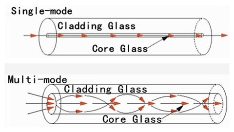

### Fiber-optic connectors & SFP-modules
There's a variety of connectors available,
the main differences are **dimensions and methods of coupling**.

Until recently, light could only travel in one direction over optical fiber.
As a result, fiber patch cables typically contain two fibers,
each terminated with its own connector—one for transmitting and one for receiving.

Most modern switches and routers have ports that support fiber-optic connectors through a **small form-factor pluggable transceiver (SFP)** module.

**Straight-Tip connectors (ST):**
- One of the first connector types
- Twist-on / twist-off mechanism

**Subscriber connector connectors (SC):**
- Referred to as 'square connectors' or 'standard connectors'
- Widely-adopted in LAN and WAN
- Push-pull mechanism

**Lucent connector simplex connectors (LC):**
- Referred to as 'little' or 'local' connectors
- Smaller version of the SC connector
- Growing in popularity due to their size

**Duplex multimode LC connectors (LC):**
- Similar to the LC connector but duplex

We also combine connector types to prescribe the type of cable, for example:
- SC-SC MMF
- LC-LC SMF
- ST-LC MMF
- SC-ST SMF

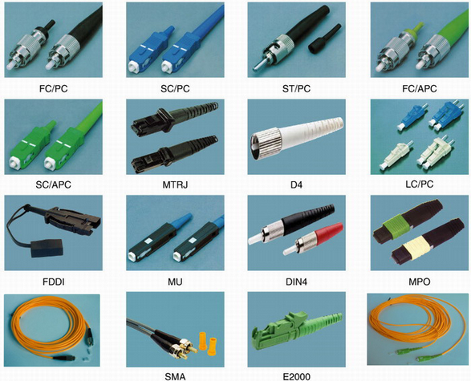

### Fiber-optic patch cord colors
**SMF is typically Yellow**.
**MMF uses Orange** (OM1/OM2), **Aqua** (OM3/OM4), or **Lime Green** (OM5)

## Wireless media
### Properties
Wireless media carry electromagnetic signals that represent the binary digits of data communications using radio or microwave frequencies.

Limitations:
- **Coverage area**: certain construction materials used in buildings and structures, and the local terrain, will limit the effective coverage.
- **Interference**: susceptible to interference and can be disrupted by such common devices as household cordless phones, some types of fluorescent lights, microwave ovens, and other wireless communications.
- **Security**: Devices and users, not authorized for access to the network, can gain access to the transmission.
- **Shared medium**: WLANs operate in half-duplex, which means only one device can send or receive at a time. The wireless medium is shared amongst all wireless users. Many users accessing the WLAN simultaneously results in reduced bandwidth for each user.

### Types of wireless media
IEEE wireless communication standards cover both data link and physical layer:
- Data to radio signal encoding
- Frequency and power of transmission
- Signal reception and decoding
- Antenna design and construction

Wireless standards:
- **Wi-Fi (IEEE 802.11)**: wireless LAN (WLAN) technology, commonly referred to as Wi-Fi. WLAN uses a contention-based protocol known as carrier sense multiple access/collision avoidance (CSMA/CA). The wireless NIC must first listen before transmitting to determine if the radio channel is clear. If another wireless device is transmitting, then the NIC must wait until the channel is clear. Wi-Fi is a trademark of the Wi-Fi Alliance. Wi-Fi is used with certified WLAN devices based on the IEEE 802.11 standards.
- **Bluetooth (IEEE 802.15)**: this is a wireless personal area network (WPAN) standard, commonly known as “Bluetooth.” It uses a device pairing process to communicate over distances from 1 to 100 meters.
- WiMAX (IEEE 802.16): commonly known as Worldwide Interoperability for Microware Access (WiMAX), this wireless standard uses a point-to-multipoint topology to provide wireless broadband access.
- Zigbee (IEEE 802.15.4): Zigbee is a specification used for low-data rate, low-power communications. It is intended for applications that require short-range, low data-rates and long battery life. Zigbee is typically used for industrial and Internet of Things (IoT) environments such as wireless light switches and medical device data collection.

### Wireless LAN
A common wireless data implementation is enabling devices to connect wirelessly via a LAN.

In general, a WLAN requires the following network devices:
- Wireless Access Point (AP)
- Wireless NIC adapters

As the technology has developed, a number of WLAN Ethernet-based standards have emerged.
When purchasing wireless devices, ensure compatibility and interoperability.

# Number systems (unfinished)
# Data link layer
## Purpose
prepares network data for transmission across the physical network and manages communication between network interface cards (NICs).
- Enables upper layers to access the physical media
- Encapsulates Layer 3 packets into Layer 2 frames
- Controls data placement, reception, and error detection

A **node** is any device that can receive, create, store, or forward data along a communications path.

It can be:
- A laptop
- A phone
- A switch

### IEEE 802 LAN/MAN Data link sublayers
IEEE 802 standards apply to LANs, WLANs, WPANs, MANs, etc.
The IEEE 802 data link layer consists of two sublayers.

**Logical Link Control (LLC), identifies data and who should receive it**:
- Identifies the Layer 3 protocol
  - Tells the system whether the payload is:
    - IPv4
    - IPv6
    - ARP
  - This allows multiple protocols to share the same NIC
- Interfaces with Layer 3
  - Receives packets from IP
  - Hands them down to MAC for framing
  - On receive, hands packets back up to the correct Layer 3 protocol
- Adds basic control info to help ensure packets are delivered to the right protocol stack

**Media Access Control (MAC), handles frame delivery on the local network**:
- Frame encapsulation, MAC builds the Ethernet frame by adding:
  - Delimiting: marks where the frame starts and ends
  - Addressing:
    - Source MAC = sender’s NIC
    - Destination MAC = next-hop NIC
  - Error detection:
    - Adds an FCS trailer (CRC)
    - Receiver can detect corrupted frames

- Media access control, MAC controls how the NIC uses the medium:
  - On Ethernet, determines when the NIC can transmit
  - On Wi-Fi, uses collision avoidance (CSMA/CA)
  - This prevents devices from talking over each other.

- NIC control, MAC directly controls the hardware:
  - Sends bits onto the wire
  - Receives bits from the wire
  - Passes frames up to LLC

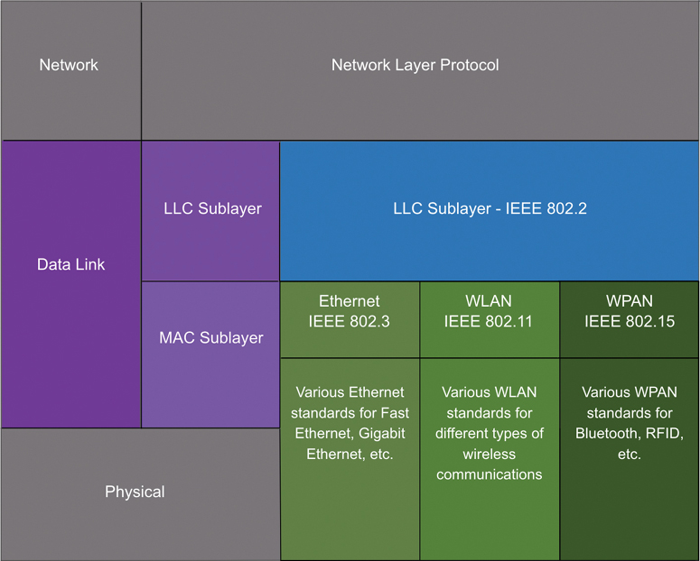

### Media access
Different network types use different methods to access the physical medium.
The MAC sublayer manages how devices share access to the network.

Router interfaces encapsulate packets into the proper frame format for each link type:
- LAN Trailer
- WAN Trailer

During transmission, a packet may pass through multiple data link layers and media types.

At each hop, a router:
- Accepts a frame from the medium
- De-encapsulates the frame
- Re-encapsulates the packet into a new frame
- Forwards it to the next network segment

## Topologies
### WAN topologies
WANs are commonly interconnecting routers using three common physical WAN topologies.

**Point-to-Point:** a permanent link between two endpoints.
- **Point-to-Point Protocol (PPP)**: connects two directly linked devices and handles framing, authentication, and error detection for data sent over serial connections.
- Still requires the device to determine if the incoming frame is destined for this node.
- May be indirectly connected to each other over some geographical distance using multiple intermediary devices.

**Hub and Spoke:** The WAN version of a star topology in which the central site interconnects branch sites.
Branch sites cannot exchange data with other branch sites without going through the central site.

**Mesh:** high availability but requires that every end system is interconnected to every other system.

**Hybrid:** a variation or combination of any topologies.


### LAN topologies
Multi-access LANs are networks where nodes are interconnected over a shared medium.
- **Star:** Central intermediary device (usually switch)
- **Extender star:** Extended with another interconnected switch.

Legacy LAN Topologies are early Ethernet and legacy Token Ring LAN technologies included two other types of topologies:
- **Bus:** end systems are chained to each other and terminated in some form on each end. Switches are not required
- **Ring:** end systems are connected to their respective neighbor forming a ring. **Legacy Fiber Distributed Data Interface (FDDI)** and **Token Ring** networks used ring topologies.


### Duplex modes
**Half-duplex communication:**
Both devices can transmit and receive on the media but cannot do so simultaneously. Only one device to send or receive at a time on the shared medium.
Think of this like a single-lane street.

**Full-duplex communication:**
Both devices can simultaneously transmit and receive on the shared media. Full-duplex allows the sending and receiving of data to happen simultaneously.
Think of this like a two-lane street.

It is important that two interconnected interfaces,
such as a host NIC and an interface on an Ethernet switch,
**operate using the same duplex mode**.
Otherwise, there will be a **duplex mismatch** creating inefficiency and latency on the link.

### Access control methods & multiaccess networks
Ethernet LANs and WLANs are examples of **multiaccess** networks.
A multiaccess network is a network that can have **two or more end devices attempting to access the network simultaneously**.

The physical topology and duplex mode determine whether contention-based or controlled access methods are required.
Multiaccess networks require rules to govern how devices share the physical media. There are two basic access control methods for shared media:

**Contention-based access:** all nodes share the same medium and attempt to transmit when they want.
**Collisions** (real or virtual) are possible and must be handled. They're handled by **CSMA/CD** & **CSMA/CA**.

**Controlled access:** nodes transmit only when explicitly allowed by a **schedule or control mechanism**.

### Carrier sense multiple access with collision detection (CSMA/CD)
CSMA/CD & CSMA/CA are processes that govern when nodes can communicate and what happens when they do so at the same time within a **half-duplex ethernet network**.

1. Two devices try to communicate over a shared medium at the same time
2. A data collision occurs 
3. Both devices detect the collision (this is the CD portion of CSMA/CD)
4. NICs compare data transmitted and data received & detect if signal amplitude is higher than usual over the shared medium. 
5. The sent data will be corrupted 
6. Both devices have to resend the data

### Carrier sense multiple access with collision avoidance (CSMA/CA)
This is another form of CSMA used by IEEE 802.11 for WLANs.
It **does not detect collisions** but **attempts to avoid** them by waiting before transmitting.

1. Devices listen before transmitting to check if the channel is free. 
2. Instead of detecting collisions, they wait a random time before sending. 
3. When a device transmits, it includes the time duration it will use the medium. 
4. Other devices wait until that time expires before trying to send. 
5. The receiver sends an acknowledgement (ACK) after successful reception.

## Data link frame
### The frame
The data link layer takes network layer data (like an IPv4 or IPv6 packet) and, 
prepares it for transmission across the local media by **encapsulating it into a frame**.

A frame consists of three main parts:
- **Header**, contains control information such as addressing.
- **Data**, the encapsulated packet from the network layer.
- **Trailer**, contains information (like error detection) added to the end of the frame.

Unlike other layers, the **data link layer adds a trailer** at the end of the frame.

Each data link protocol (such as Ethernet, Wi-Fi, etc.) defines its own frame structure,
meaning **frame formats vary** depending on the network type.
This variation is necessary because different media and topologies have different requirements for access control and reliability.

For example, a **WLAN frame includes extra control information to handle collision avoidance (CSMA/CA)**,
making it more complex than an Ethernet frame.

In short: the data link layer provides reliable,
local **NIC-to-NIC communication** by packaging packets into frames tailored to the needs of the specific network medium.

### Frame fields
A frame contains several fields that organize and manage data transmission across the local network:
- **Frame Start/Stop Indicators:** Mark the beginning and end of the frame.
- **Addressing:** Identify the **source and destination** nodes on the medium.
- **Type:** Specifies the **Layer 3 protocol** (e.g., IPv4 or IPv6) carried in the data field.
- **Control:** Provides **flow control and QoS (Quality of Service)** features. For instance, VoIP frames get higher priority because they’re delay-sensitive.
- **Data:** The **payload**, containing the network layer packet (which includes the segment header and application data).
- **Error Detection (Trailer):** Contains the **Frame Check Sequence (FCS)** used for error detection.


### Trail & error detection
The transmitter calculates a **Cyclic Redundancy Check (CRC)** value,
a mathematical summary of all bits in the frame and places it in the **Frame Check Sequence (FCS)** field.
The receiver recalculates this value on arrival.
If the two don’t match,
the frame has been corrupted during transmission (e.g., by interference or signal loss).

### Local scope of data link layer addresses
Data link layer addresses (physical or MAC addresses) are **used only for local delivery** within a single network segment,
they have no meaning beyond the local network.

In contrast, Layer 3 addresses (IP addresses) are **end-to-end identifiers**.
They remain the same from the source host to the destination host.

### Data link layer protocols summary
Ethernet is the main Layer 2 protocol used in wired LANs,
while WLAN (IEEE 802.11) protocols are used for wireless LANs.
Both are designed for multiaccess networks,
where multiple devices share the same medium.

Historically, WANs used different Layer 2 protocols to support various topologies:
- Point-to-Point Protocol (PPP)
- High-Level Data Link Control (HDLC)
- Frame Relay
- Asynchronous Transfer Mode (ATM)
- X.25

Today, these traditional WAN protocols are largely being **replaced by Ethernet-based WAN protocols**.

In a TCP/IP network, all Layer 2 protocols work with IP (Layer 3). The specific Layer 2 protocol used depends on:
- The **logical topology** (how nodes connect logically)
- The **physical media** (the actual transmission medium)

Each Layer 2 protocol includes its own **media access control methods** for managing access on its specific topology.
Devices operating at this layer include network interface cards (NICs),
router interfaces, and Layer 2 switches.

The choice of Layer 2 protocol depends on the network’s size, geographic scope, and required services:
- **LANs** use high-bandwidth technologies to support many hosts in a limited area (like a building or campus), making Ethernet and WLAN cost-effective.
- **WANs**, which span larger geographic areas, typically use lower-bandwidth technologies due to the higher cost of long-distance links.

Because of these differences in bandwidth and cost, **LANs and WANs use different data link layer protocols**.

Examples of **common Layer 2 protocols**:
- Ethernet
- 802.11 Wireless
- PPP
- HDLC
- Frame Relay

# Ethernet switching
## Ethernet frames
### Ethernet encapsulation
Ethernet operates in the data link layer and the physical layer.
It is a family of networking technologies defined in the **IEEE 802.2 and 802.3** standards.
It supports bandwidths of up to 100 Gbps.


### Data link sublayers
Recall that LLC and MAC have the following roles in the data link layer:
- **LLC (IEEE 802.2)**: communication between upper and lower layers
- **MAC (IEEE 802.3, 802.11 & 802.15)**: frame creation, CSMA/CD & CA & data link layer addressing

MAC sublayer: responsible for data encapsulation and accessing the media.

IEEE 802.3 (Ethernet) data **encapsulation includes**:
- Ethernet **frame**, internal structure
- Ethernet **addressing**, src and dst MAC addressing for NIC to NIC communication
- Ethernet **Error Detection**, Frame Check Sequence (FCS) trailer used for ED

IEEE 802.3 (Ethernet) **accessing media**:
- **Duplex modes**
- **CSMA/CD** (802.3)
- **CSMA/CA** (802.11)

### Ethernet frame fields
Ethernet frames have a minimum size,
anything below the minimum size is considered a **"collision" or "runt" frame**.
Frames over 1500 bytes are considered **"jumbo" or "baby giant" frames**.

Frames above the maximum or below the minimum size are **discarded / dropped** by the receiving node.
Dropped frames are likely the result of collisions or unwanted signals, they're considered invalid.

Jumbo frames are usually supported by most Fast Ethernet and Gigabit Ethernet switches and NICs:
- **Minimum size is 64 bytes / frame**
- Expected **maximum size is 1518 bytes** or 1.5 Gigabytes
- May be bigger if VLAN tags are involved (beyond our current scope)


- **Preamble, 7 bytes:** lets the receiver **synchronize its clock** with the incoming bit stream before the real data starts.
- **Start frame delimiter (SFD):** a unique byte (`0xD5`) that **marks the start of the ethernet frame**.
- **Src & Dst MAC addresses, 6 byte:** unique addresses tied to the hardware manufacturers. If there is a match on the Dst MAC the device will accept the frame. This can be any **unicast, multicast or broadcast address**.
- **Type / Length, 2 bytes:**  identifies the upper layer protocol encapsulated in the frame. Also named EtherType, Type or Length.
  - IPv4 - `0x800`
  - IPv6 - `0x86DD`
  - ARP - `0x806`
- **Data, 46 to 1500 bytes:** encapsulated data, if the packet is too small then additional **bits will be padded** to increase the field size to the minimum size.
- **Frame Check Sequence (FCS), 4 bytes:** used to detect errors in the frame. It uses a **Cyclic Redundancy Check (CRC)** which is a mathematical calculation that **must match** the incoming packets' calculation.

## Ethernet MAC addresses
### Hexadecimal
An Ethernet MAC address consists of a 48-bit binary value.
Hexadecimal is used to identify an Ethernet address because a single hexadecimal digit represents four binary bits.
Therefore, a 48-bit Ethernet MAC address can be expressed using only 12 hexadecimal values.

Hexadecimal numbers are often represented by the value preceded by `0x` (e.g., `0x73`) or by a **subscript 16**,
or the hex number followed by an `H` (e.g., `73H`).

### Ethernet MAC addresses
All MAC addresses must be **unique** to the Ethernet device or Ethernet interface.
To ensure this,
all vendors that sell Ethernet devices must register with the IEEE to obtain a **unique 6 hexadecimal** (i.e., 24-bit or 3-byte) code,
called the **organizationally unique identifier (OUI)**.

When a vendor assigns a MAC address to a device or Ethernet interface, the vendor must do as follows:
- Use its assigned **OUI** as the **first 6 hexadecimal digits**.
- Assign a **unique value** in the **last 6 hexadecimal digits**.

It is the responsibility of the vendor to ensure that none of its devices be assigned the same MAC address.
However, it is **possible for duplicate MAC addresses to exist** because of mistakes made during manufacturing,
mistakes made in some virtual machine implementation methods,
or modifications made using one of several software tools.

### Frame processing
Each NIC has a unique **burned-in address (BIA)** stored permanently in **read-only memory (ROM)**.
The **BIA** is the **original, manufacturer-assigned MAC address** of a network interface.

When the device starts,
the NIC **copies this MAC address into RAM** for active use.

When an Ethernet frame is **received**,
the NIC checks the destination MAC address against the one stored in **RAM**:
- If the address matches, or if it’s a broadcast or multicast frame, the NIC **accepts it and sends it up** the OSI layers for de-encapsulation.
- If there is **no match**, the NIC **discards** the frame.

### Unicast MAC addresses
Used when a frame is sent from a single transmitting device to a single destination device.

The process that a source host uses to determine the destination MAC address associated with an **IPv4** address is known as **Address Resolution Protocol (ARP)**.

The process that a source host uses to determine the destination MAC address associated with an **IPv6** address is known as **Neighbor Discovery (ND)**.

### Broadcast MAC addresses
- **Address**: `FF:FF:FF:FF:FF:FF`
- **Behavior:** Frame is **flooded out all switch ports except the incoming** / source, **not forwarded by routers**.

Example protocols:
- DHCP for IPv4
- ARP message ethernet broadcast

### Multicast MAC addresses
- **Purpose:** Frame is received by all devices in the same multicast group.
- **IPv4 Address**: `01:00:5E` prefix
- **IPv6 Address**: `33:33` prefix
- **Behavior:** Flooded to all switch ports (except source) unless multicast snooping is enabled, routers forward only if configured for multicast routing.

**Note:** There are other reserved multicast destination MAC addresses for when the encapsulated data is not IP,
such as **Spanning Tree Protocol (STP)** and **Link Layer Discovery Protocol (LLDP)**.

## MAC address table
### Switch fundamentals
If a switch just forwarded every frame it received out all ports,
your network would be so congested that it would probably come to a complete halt.

The switch makes its forwarding decisions based solely on the Layer 2 Ethernet MAC addresses.

An Ethernet switch examines its **MAC address table** to make a forwarding decision for each frame,
unlike legacy Ethernet hubs that repeat bits out all ports except the incoming port.

The MAC address table is sometimes referred to as a **content addressable memory (CAM)** table.
While the term CAM table is fairly common,
for the purposes of this course, we will refer to it as a MAC address table.

### Switch learning & forwarding
A switch builds a MAC address table **from source MACs in incoming frames** and port numbers.

Learning algorithm:
1. If source MAC is not in the table → add the **MAC address and incoming port number**
2. If source MAC is in the table → **refresh the timer** (**default ~5 min**)
3. If source MAC is in the table & incoming port number is different → **update** the table entry

Forwarding if destination MAC is unicast:
- If match in table → forward frame out that port, known **frame filtering**
- If no match in table → flood out all ports except incoming port

Forwarding if destination MAC is broadcast or multicast:
- flood out all ports except incoming port

**Key idea:**
1. learning populates the table from sources
2. forwarding uses that table
3. unknown or group destinations cause flooding.

### Filtering frames
As a switch receives frames from different devices,
it is able to populate its MAC address table by examining the source MAC address of every frame.
When the MAC address table of the switch contains the destination MAC address,
it is able to **filter the frame and forward out a single port**.

### Nested MAC address tables
A switch can have multiple MAC addresses associated with a single port.
This is common when the **switch is connected to another switch**.

The switch will have a separate MAC address table entry for each frame received with a different source MAC address.

Example, MAC address table with nested entries:
```terminaloutput
Switch 1 MAC Address Table
--------------------------------
MAC Address            Port
--------------------------------
AA:AA:AA:AA:AA:AA      Gi0/1
BB:BB:BB:BB:BB:BB      Gi0/1
CC:CC:CC:CC:CC:CC      Gi0/2   (router)
DD:DD:DD:DD:DD:DD      Gi0/3   (server)
--------------------------------
```

### Sending the Frame to the Default Gateway / Router
When a device has an IP address that is on a **remote network**,
the Ethernet frame cannot be sent directly to the destination device.
Instead, the **Ethernet frame is sent to the MAC address of the default gateway**, the router.

## Switch speeds and forwarding methods
### Frame forwarding methods on Cisco switches
Cisco switches use two methods to forward frames.

**Store-and-Forward:** Receives the entire frame and **checks CRC** for errors. This **only forwards valid frames**.
This way it **filters corrupt data**. It also **supports QoS** (e.g., VoIP prioritization).

**Cut-Through:** Forwards the frame as soon as the destination MAC is read. This **forwards any frames**.
This way there's **lower latency**. However, this **may forward corrupt frames**.

Summary:
- Store-and-forward = reliable + QoS capable.
- Cut-through = faster but less error checking.

### Cut-through switching
The switch only reads the destination MAC (first **6 bytes after preamble**),
looks it up in the MAC table, and immediately forwards the frame without any error checking.
The main goal here is to minimize latency.

There are two cut-through switching variants:
- **Fast-forward switching:** immediately forwards after reading the destination MAC address.
- **Fragment-free switching:** **buffers first 64 bytes before forwarding**. This is because most errors and collisions happen within the first 64 bytes of a frame.

**Adaptive behavior:**
Some switches **switch modes automatically**. They use cut-through until error rate exceeds a threshold,
then revert to store-and-forward, returning to cut-through when errors drop.

### Memory buffering on switches
Switches buffer frames when **forwarding delays** occur (e.g., busy or congested destination ports).

**Port-based memory buffering:**
- **Each port has a queue** for incoming and outgoing frames
- Frames are transmitted **in order** per port
- **A busy destination port can block all frames in its queue**. Even those destined for idle ports.
- Results in **potential delay and lower efficiency**

Queue example:
```terminaloutput
[Sw-Floor-1, Port 1 queue]
├─ Frame 1 (waiting on port 2) → Port 2 (busy)
├─ Frame 2 (blocked by frame 1) → Port 1 (idle)
├─ Frame 3 (blocked by frame 2) → Port 1 (idle)
└─ ...
```

**Shared memory buffering:**
- All frames are stored in a **common buffer pool shared by all ports**.
- Buffer pool space is **dynamically allocated based of traffic load**.
- Frames are **logically linked to their destination ports**, no need to move between queues.
- Allows for larger frames and **fewer drops**, ideal for **asymmetric switching** (e.g., 10 Gbps uplink ↔ 1 Gbps clients)

Summary:
- Port-based memory buffering: simpler but less flexible, susceptible to per-port congestion.
- Shared memory buffering: dynamic, efficient, supports mixed-speed environments with reduced frame loss.

### Duplex modes & speed settings
Each switch port has two key parameters:
- bandwidth (speed)
- duplex mode

Duplex modes recap:
- Full-duplex: Both ends can **send and receive simultaneously**, no collisions.
- Half-duplex: **Only one direction at a time**, uses **CSMA/CD or CSMA/CA**, prone to **collisions or latency**.

Switch auto-negotiation:
- Automatically selects the **highest common speed** and **best duplex mode** supported by both devices.
- Enabled by default on most Cisco switches and NICs.
- **Gigabit Ethernet ports** = full-duplex only (no half-duplex option)

Duplex mode mismatching:
- Happens when one side is full-duplex and the other half-duplex.
- Causes collisions, retransmissions, and poor performance.
- Common after port resets or manual misconfiguration.
- **Prevented by enabling auto-negotiation on both and or manual configuration.**

### Automatic Medium-Dependent Interface Crossover (Auto-MDIX)
Legacy:
- **Straight-through cable** → connect unlike devices (e.g., PC ↔ switch).
- **Crossover cable** → connect like devices (e.g., switch ↔ switch, PC ↔ PC).

Auto-MDIX:
- Switch **automatically detects cable type** (straight or crossover) and adjusts TX/RX pin use.
- Works on **10/100/1000 Mbps copper ports**.
- Allows **any cable type** between any devices.
- Enabled by default on Cisco IOS 12.2(18)SE+.
- Can be toggled with `mdix auto` command in interface config mode.

**Best practice:** Always use the correct cable type when possible,
don’t rely solely on Auto-MDIX in case it’s disabled.

# Network layer
## Network layer characteristics
### Network layer protocols
The network layer communication protocols specify the **packet structure and processing** used to carry data from one host to the next.
They operate **without regard of the data**,
which allows them to **carry packets of multiple types between multiple hosts**.

Network protocols:
- IPv4
- IPv6
- Internet Control Message Protocol (ICMP)
- Open Shortest Path First (OSPF)
- Network Address Translation (NAT)

Network Layer Functions:
- **Addressing:** Assigns each device a unique IP address for identification.
- **Encapsulation:** Wraps the transport layer PDU in an IP packet with source/destination headers.
- **Routing:** Moves packets between networks, routers select the best path, each hop = one router.
- **De-encapsulation:** Destination host removes IP header and passes the payload up to the transport layer.

### IP encapsulation
The IP protocol wraps the transport layer PDU or **segment** inside an IP **packet** by adding an IP header.

- **Header purpose:** contains source and destination IP addresses, examined by routers and Layer 3 switches as the packet moves across networks.
- **Address consistency:** IP addressing stays the same from source to destination, **unless modified by NAT**.
- **Routing:** Routers use the IP header’s network layer info to determine the best path between networks.
- **Data integrity:** The encapsulated transport-layer data (payload) is not modified during network-layer processing.

### Characteristics of IP
IP was designed as a low-overhead protocol. Only to deliver packets from hop to hop.

- **Connectionless:** No connections are established before sending packets.
- **Best Effort:** IP is unreliable because **packet delivery is not guaranteed**.
- **Media Independent:** Operations are independent of the medium carrying the data.

#### Connectionless
Essentially the packet is just sent **without an initial exchange** of control information.
No pre-established connections or any connections at all are made.

#### Best effort (unreliable delivery)
IP provides no guarantee that packets reach their destination.
It sends packets without knowing if the receiver exists,
is reachable, or successfully receives them.
There are no acknowledgment or retransmission mechanisms.
Reliability is handled by higher-layer protocols like TCP.

#### Media independent
IP functions the same across all physical media.
The data link layer (LLC) handles adapting IP packets for transmission on a given medium.
Each medium has a **Maximum Transmission Unit (MTU)**, the largest PDU it can carry.
The **data link layer reports the MTU to the network layer, which uses it to size packets**.
If a packet exceeds the MTU of a network segment,
**routers may fragment it (in IPv4), in IPv6 however it does not allow fragmentation by routers.**

## IPv4 packets
### IPv4 packet header fields (20 bytes total)
- **Version (4 bits):** Always `0100` for IPv4.
- **Internet Header Length (IHL) (4 bits):** Identify header size
- **Differentiated Services / DiffServ (DS) (8 bits):** Defines packet priority / QoS handling:
  - DS Code Point (DSCP) (4 bits)
  - Explicit Congestion Notation (ECN) (4 bits)
- **Total Length (16 bits):** identify total packet size.
- **Identification (16 bits):** Used for fragmentation and reassembly.
- **Flags (3 bits):**
  - bit 0: Reserved, always 0
  - bit 1: Don't Fragment bit
  - bit 2: More fragments bit
- **Fragment Offset (13 bits):** Position of this fragment in the original packet.
- **Time-To-Live (TTL) (8 bits):** Decreases by 1 per hop, packet discarded at 0 → ICMP Time Exceeded sent.
- **Protocol (8 bits):** Indicates upper-layer protocol (e.g., ICMP = 1, TCP = 6, UDP = 17).
- **Header Checksum (16 bits):** Validates header integrity (recomputed at each hop because of TTL).
- **IPv4 Source (32 bits) & Destination addresses (32 bits):** 32-bit addresses identifying sender and receiver.
- **Options + Padding (0-320 bits):** only present if IHL > 5 (header max size = 60 bytes).


## IPv6 packets
### Limitations of IPv4
- **Address depletion:** ~4 billion unique addresses are insufficient for today’s internet scale.
- **Loss of end-to-end connectivity:** NAT hides internal hosts behind one public IP, breaking direct connections.
- **Added complexity:** NAT, originally a temporary fix, increases configuration complexity and latency.

### Improvements of IPv4
- **Vast address space:** 128-bit addresses provide 340 undecillion unique IPs.
- **Simplified header:** Fewer fields enable faster and more efficient packet processing.
- **No NAT required:** Restores true end-to-end connectivity and reduces network complexity.

### IPv6 packet header fields (40 bytes)
- **Version (4 bits):** `0110` for IPv6.
- **Traffic Class (8 bits):** packet priority / Qos (comparable to IPv4's DS field but with different DSCP & ECN sizes)
  - DSCP (6 bits)
  - ECN (2 bits)
- **Flow Label (20 bits):** Ensures consistent handling of related packets
- **Payload Length (16 bits):** Size of data, excluding header
- **Next Header (8 bits):** Identifies upper-layer protocol (like IPv4 Protocol)
- **Hop Limit (8 bits):** Decrements per hop (comparable to IPv4's TTL field)
- **IPv6 Source (128 bits) & Destination addresses (128 bits):** 128-bit addresses identifying sender and receiver.

Routers do not fragment IPv6 packets, fragmentation is handled by the source.
## Host forwarding
### Host forwarding decisions
When a host sends an IP packet, it checks its **routing table** to decide where to forward it.

Possible destinations:
- **Itself:** Loopback address, `127.0.0.1` (IPv4) or `::1` (IPv6).
- **Local host:** Destination is on the same network (different IP, same subnet).
- **Remote host:** Destination is on a different network.

How it determines this:
- **IPv4:** Compares its **own IP and subnet mask** with the destination IP.
- **IPv6:** Learns **local network prefix from router advertisements**.

### Default gateway
The default gateway is the Layer 3 device (**router or L3 switch**) that routes traffic outside the local network / remote destinations.
- Has a local IP in the same subnet as the hosts.
- Receives local traffic and forwards it to other networks.
- Enables communication beyond the LAN.

Without a configured default gateway, a host cannot reach external networks.

#### The default route
Having a default gateway configured creates a **default route**.
The default route is the route your computer will take when it tries to contact a remote network.

#### Default gateway configuration
- IPv4: Default gateway is automatically assigned via **DHCP**, or manually configured.
- IPv6: Default gateway is **advertised by the router**, or manually configured.

### Inspecting (Windows) host routing tables with `route print` & `netstat -r`
On Windows, use `route print` or `netstat -r` to view the routing table (both show **identical** output).

The table exists of 3 parts:
- **Interface List:** Shows all network interfaces, their **MAC addresses**, and interface numbers (Ethernet, Wi-Fi, Bluetooth, etc.).
- **IPv4 Route Table:** Displays all known IPv4 active routes - direct connections, local network routes, and the default route.
- **IPv6 Route Table:** Displays all known IPv6 active routes — direct connections, local network routes, and the default route.

## Introduction to routing
### Router packet forwarding decisions
Just like hosts, routers use routing tables (also called **forwarding tables**) to decide where to send packets.

When a router receives a packet:
- It examines the destination IP address in the packet header.
- It then compares that address with the **entries (routes)** in its routing table.
- Each entry represents a known network prefix and indicates the next-hop address and outgoing interface used to reach that network.

In short: routers forward packets based on the best matching route in their routing table,
ensuring packets move hop by hop toward their destination network.

### Router IP routing table
A router’s IP routing table contains entries that tell it **where to forward packets**.
Routes fall into three categories:

- **Directly-connected networks:** Automatically learned from active interfaces. These networks are **reachable without another router**.
- **Remote networks:** Learned via static configuration or dynamic routing protocols.
- **Default route:** Gateway of last resort when no specific route matches.

A router can learn about **remote networks** in two ways:
- **Static routes:** Manually configured.
- **Dynamic routes:** Learned automatically via routing protocols  
  (e.g., RIP, OSPF, EIGRP, BGP).

Example routing / forwarding table:
```terminaloutput
Router R1 interfaces:
- G0/0 → 192.168.1.1/24 (LAN)
- G0/1 → 192.168.2.1/24 (Internal transit link)

Routing table:
192.168.1.0/24     directly connected, G0/0
192.168.2.0/24     directly connected, G0/1
10.0.0.0/8         via 192.168.2.2
172.16.0.0/12      via 192.168.2.2
0.0.0.0/0          via 192.168.1.254 (default route)
```

### Static routing
Static routes are manually configured route entries.
They are configured in global configuration mode using: 
`ip route <destination-network> <subnet-mask> <next-hop | exit-interface>`

Static routes do not adapt to changes in network topology.
If the topology changes, the routes **must be updated manually**.

Examples:
- Static remote route: `ip route 10.0.0.0 255.0.0.0 192.168.2.2`
- Static default route: `ip route 0.0.0.0 0.0.0.0 192.168.1.254`

### Dynamic routing
Dynamic routing protocols allow routers to automatically learn about remote networks
and update routes when the network topology changes.

Routing protocols automatically:
- Discover remote networks
- Exchange routing information with other routers
- Select the best path to destination networks
- **Recalculate routes** if the current path becomes unavailable

Common dynamic routing protocols include:
- **Open Shortest Path First (OSPF)**
- **Enhanced Interior Gateway Routing Protocol (EIGRP)**
- Others: RIP, BGP

### IPv4 routing table introduction
The `show ip route` command (privileged EXEC mode) is used to examine a router’s
IPv4 routing table.

The first column contains **routing source codes**, which indicate how each route
was learned:

- **L**, Local route (IP address assigned to a router interface)
- **C**, Directly connected network
- **S**, Static route (manually configured)
- **S***, Default static route (gateway of last resort)
- **O**, OSPF (Open Shortest Path First)
- **D**, EIGRP (Enhanced Interior Gateway Routing Protocol)

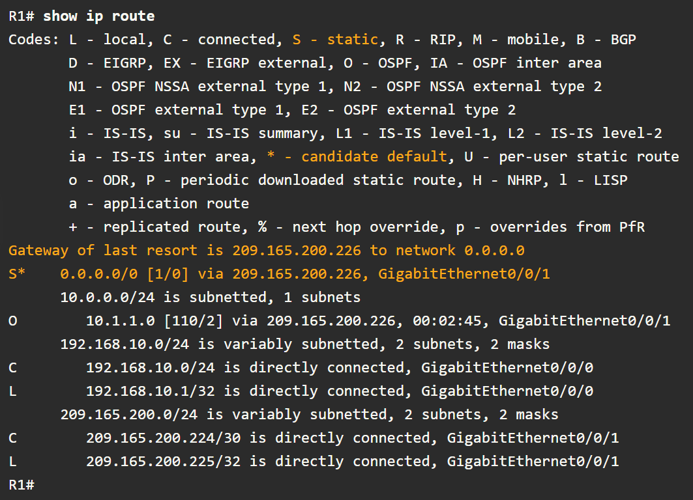

# Address resolution
## MAC and IP
### Destination on the same network

When a host sends a message, it must know both the **IP address** and the **MAC address**
of the destination.
Sometimes the host initially knows only the **IP address**, this is where
**address resolution** is required.

Ethernet LAN addresses recap (analogy):
- **Physical address (MAC):** Used for NIC-to-NIC delivery on the local network  
  *(like moving a package to the next street).*
- **Logical address (IP):** Used to identify the source and final destination device  
  *(like the full street address the postman is trying to reach).*

If the destination IP address is on the **same network**:
- The source host resolves the destination IP to a MAC address.
- The Ethernet frame is sent **directly to the destination device**.
- No router is involved in the delivery.

### Destination on a remote network
When the destination IP address (IPv4 or IPv6) is on a **remote network**,
the **source host** sends the frame to the **default gateway** instead of directly
to the destination device.

- The **destination MAC address** is the MAC address of the default gateway.
- The **destination IP address** remains the final destination host.

**The default gateway:**
- De-encapsulates the incoming Ethernet frame.
- Examines the destination IP address.
- Forwards the packet to the **next hop** by re-encapsulating it
  in a new frame with appropriate MAC addresses.

**Along each link:**
- IP packets are mapped to MAC addresses using an address resolution process.
- **Adress Resolution Protocol (ARP)** is used for IPv4.
- **ICMPv6 Neighbor Discovery (ND)** is used for IPv6.

## ARP (IPv4)
### ARP Functions & the ARP table
ARP provides two basic functions:
- Resolving IPv4 addresses to MAC addresses
- Maintaining a table of IPv4-to-MAC address mappings

The table containing mappings of **local network devices** is stored in **RAM**,
and is called the **ARP table** or **ARP cache**.

ARP table entries are **time-stamped**.
If an entry is not used before the timer expires, it is removed from the ARP table.

Static ARP entries are possible but uncommon.
- Static entries do not expire.
- They must be manually configured and removed.

The ARP process:
1. The sending device searches its ARP table for a matching entry:
   - If the destination is on the **local network**, it looks for a mapping for the destination IP address.
   - If the destination is on a **remote network**, it looks for a mapping for the default gateway’s IP address.
2. If no entry is found, the device sends an **ARP request** (broadcast) asking for the MAC address.
3. The device owning the requested IP address replies with an **ARP reply** (unicast).
4. The sender stores the mapping in the ARP table and sends the frame.

### ARP request (broadcast)
An ARP request is sent for IPv4 destinations on the local network when the source
host does not know the destination MAC address and has no matching entry in its
ARP table.

ARP messages are encapsulated **directly in an Ethernet frame (Layer 2)**.
There is **no IPv4 header** involved.

Ethernet frame fields:
- **Destination MAC:** `FF:FF:FF:FF:FF:FF` (broadcast)
- **Source MAC:** Source host’s MAC address
- **EtherType:** `0x806` (ARP)

All devices on the local network must process the ARP request to determine
whether the target IPv4 address matches their own.
- If the address does not match, the device ignores the request.
- If the address matches, the device sends an **ARP reply**.

**Routers do not forward ARP broadcasts** out other interfaces,
as broadcasts are limited to the local network.

### ARP reply (unicast)
Only the host that sent the ARP request receives the **unicast ARP reply**.
Once received, the sender creates a new IP-to-MAC mapping in its ARP table.

If no device responds to the ARP request:
- The sender cannot determine the destination MAC address.
- The original **IPv4 packet is dropped**, as it cannot be encapsulated in an Ethernet frame.

Ethernet frame fields:
- **Destination MAC:** receiver host’s MAC address (unicast)
- **Source MAC:** Source host’s MAC address
- **EtherType:** `0x806` (ARP)

### Removing entries from an ARP table
Each device uses an **ARP cache timer** to remove ARP entries whose time-stamps
have expired.

On **modern Windows systems**, ARP table entries typically expire
after **15 to 45 seconds** if they are not used.

ARP entries can also be removed **manually** using system commands,
either selectively or by clearing the entire ARP table.

### Inspecting ARP tables with `show ip arp` & `arp -a`

On a Cisco router, the **privileged EXEC mode** command `show ip arp`
is used to display the ARP table.

On a modern Windows system, the `arp -a` command
is used to view the local ARP cache.

Both commands display the current IPv4-to-MAC address mappings
learned on the local network.

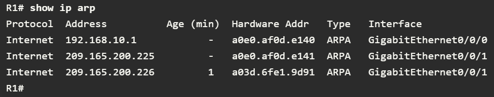


### ARP issues: broadcasts & spoofing
Because an ARP request is a **broadcast**, it is received and processed by every device on the local network.
Under normal conditions, this has minimal impact on network performance.
However, if many devices power on and begin communicating at the same time,
ARP traffic can cause a **temporary performance impact**.

ARP can also present a **security risk** where,
a threat actor may perform **ARP spoofing** (also called **ARP poisoning**).

**ARP spoofing attack:**
- The attacker sends a forged ARP reply.
- The reply associates the attacker’s MAC address with another device’s IP address.
- The victim updates its ARP table incorrectly, because **the table always accepts the last entry regardless**
- The victim then sends traffic to the attacker.

Enterprise-grade switches include mitigation techniques,
such as **Dynamic ARP Inspection (DAI)** to help prevent ARP spoofing attacks.

## ICMPv6 Neighbor Discovery (IPv6)

ICMPv6 Neighbor Discovery (ND) provides IPv6 address resolution, similar in purpose to IPv4 ARP.
### ICMPv6 ND Address Resolution
**Local resolution process:**
1. The source host checks its **Neighbor Cache** (IPv6 equivalent of an ARP table).
2. If no entry exists, the **IPv6 packet is queued**, and the host sends a **Neighbor Solicitation (NS) message**.

**Neighbor Solicitation (NS) or request:**
- NS is an **ICMPv6 message**, not a standalone Ethernet protocol like ARP.
- It is encapsulated as **ICMPv6 → IPv6 → Ethernet**
- The target IPv6 address is mapped to a **Solicited-Node (SN) multicast IPv6 address**, which maps to a **special Ethernet multicast address**.
- This **makes ND more targeted than ARP broadcasts**.
- Only hosts listening to that SN multicast group process the request.
- The SN multicast scope is **link-local**, so **routers do not forward the message**.

**Neighbor Advertisement (NA) or reply:**
- The device owning the target IPv6 address:
  - Updates **its own Neighbor Cache**
  - Sends a **Neighbor Advertisement (NA)** back to the source
- The NA is:
  - **Unicast at Ethernet**
  - Contains an IPv6 packet carrying an ICMPv6 NA message
  - Upon receiving the NA by the source host, it **updates its Neighbor Cache and sends the queued packet**.

### ICMPv6 ND Messages
ICMPv6 Neighbor Discovery (ND) uses **five message types** to support:
- Address resolution
- Router discovery
- Traffic redirection

ND message types:
- Neighbor Solicitation (NS, request)
- Neighbor Advertisement (NA, reply)
- Router Solicitation (RS, request)
- Router Advertisement (RA, reply)
- Redirect Message

**Neighbor Solicitation (NS) & Neighbor Advertisement (NA):**
- **Device-to-Device** messaging
- **Address resolution**
- Functionally similar to IPv4 ARP.

**Router Solicitation (RS) & Router Advertisement (RA):**
- **Device-to-router** messaging
- Support **router discovery**.
- Commonly used for:
  - **Dynamic IPv6 configuration**
  - **Stateless Address Autoconfiguration (SLAAC)**

**Redirect Message:**
- Used by routers **to inform a host of a better next-hop** for a specific destination.
- Helps **optimize routing paths** on the local link.

# Basic router configuration
## Configuring initial router settings
### Commands
**Configure the device name:**
```terminaloutput
Router(config)# hostname hostname
```

**Secure privileged EXEC mode:**
```terminaloutput
Router(config)# enable secret password
```

**Secure user EXEC mode:**
```terminaloutput
Router(config)# line console 0  
Router(config-line)# password password  
Router(config-line)# login
```

**Secure VTY lines / remote access:**
The `transport input { ssh | telnet }` command **controls which remote-access protocols are allowed** on the VTY lines.

Best practice is to allow ssh only using: `transport input ssh`,
or even disable remote access using `transport input none`.
Note that you can configure this for a **range** of VTY lines,
make sure you configure all of them.
Newer Cisco IOS systems will have **ssh-only VTY lines** configured by default.

```terminaloutput
  Router(config-line)# line vty 0 4  
  Router(config-line)# password password
  Router(config-line)# login  
  Router(config-line)# transport input { ssh | telnet }
```

**Secure all passwords in the config file:**
```terminaloutput
  Router(config-line)# exit  
  Router(config)# service password-encryption
```

**Provide legal notification:**
```terminaloutput
Router(config)# banner motd delimiter message delimiter
```

**Save the configuration:**
```terminaloutput
Router(config)# end
Router# copy running-config startup-config
```

### Practical example
```terminaloutput
Router> enable
Router# configure terminal
Enter configuration commands, one per line.
End with CNTL/Z.
Router(config)# hostname R1
R1(config)#

R1(config)# enable secret class
R1(config)#
R1(config)# line console 0
R1(config-line)# password cisco
R1(config-line)# login
R1(config-line)# exit
R1(config)#
R1(config)# line vty 0 4
R1(config-line)# password cisco
R1(config-line)# login
R1(config-line)# transport input ssh telnet
R1(config-line)# exit
R1(config)#
R1(config)# service password-encryption
R1(config)#

R1(config)# banner motd #
Enter TEXT message. End with a new line and the #
***********************************************
WARNING: Unauthorized access is prohibited!
***********************************************
#
R1(config)#

R1# copy running-config startup-config
Destination filename [startup-config]?
Building configuration...
[OK]
R1#
```

## Configuring router interfaces
Routers are not reachable by end devices until interfaces are configured.
The `description` command is not required to enable an interface, it is however good practice to use describe the enabled interfaces.

The `no shutdown` command activates the interface. The interface must also be **connected** to another device, such as a switch or a router, for the physical layer to be active.

Interfaces mostly look like:
- GigabitEthernet 0/0/0 (G0/0/0)
- GigabitEthernet 0/0/1 (G0/0/1)

Example:
```terminaloutput
R1> enable
R1# configure terminal

R1(config)# interface gigabitEthernet 0/0/0

R1(config-if)# description Link to LAN
R1(config-if)# ip address 192.168.10.1 255.255.255.0
R1(config-if)# ipv6 address 2001:db8:acad:10::1/64
R1(config-if)# no shutdown
R1(config-if)# exit

R1(config)# interface gigabitEthernet 0/0/1

R1(config-if)# description Link to R2
R1(config-if)# ip address 209.165.200.225 255.255.255.252
R1(config-if)# ipv6 address 2001:db8:feed:224::1/64
R1(config-if)# no shutdown
R1(config-if)# exit
```

### Verify connectivity
The most useful commands to verify the interface configurations are:
- `show ip interface brief`
- `show ipv6 interface brief commands`

Others are:
- `show ip interface`
- `show ipv6 interface`
- `show interfaces`, note that this only displays IPv4 addressing infermation. 
- `show ip route`
- `show ipv6 route`

Example:
```terminaloutput
R1# show ip interface brief
Interface              IP-Address      OK? Method Status                Protocol
GigabitEthernet0/0/0   192.168.10.1    YES manual up                    up
GigabitEthernet0/0/1   209.165.200.225 YES manual up                    up
Vlan1                  unassigned      YES unset  administratively down down

R1# show ipv6 interface brief
GigabitEthernet0/0/0       [up/up]
    FE80::201:C9FF:FE89:4501
    2001:DB8:ACAD:10::1
GigabitEthernet0/0/1       [up/up]
    FE80::201:C9FF:FE89:4502
    2001:DB8:FEED:224::1
Vlan1                      [administratively down/down]
    unassigned
```


## Configuring the default gateway
A default gateway is the router a host uses to send traffic to **other networks**.
If the destination is on the same **subnet**, traffic goes directly through the switch. If it’s on a different subnet, the host forwards the packet to its default gateway, which routes it to the correct network.

A Layer 2 switch **does not need an IP address** to switch traffic, but it does need an IP address on its SVI and a default gateway for **remote management**. The default gateway is the router interface connected to the switch and allows the switch to reply to management traffic from other networks.

For IPv4, the gateway is set manually with ip default-gateway, for IPv6, the switch learns the gateway automatically via ICMPv6 Router Advertisements.

You can configure it using the: `ip default-gateway <ipv4 address>` command.

# IPv4 addressing
## IPv4 address structure
### Network and host portions
An IPv4 address is made up of 4 octects consisting of 8 bits each, totaling 32 bits.

All the bits in the network portion must be indentical for all hosts in the same network.
The subnet mask defines the network portion, every set bit in the mask is part of the network portion.

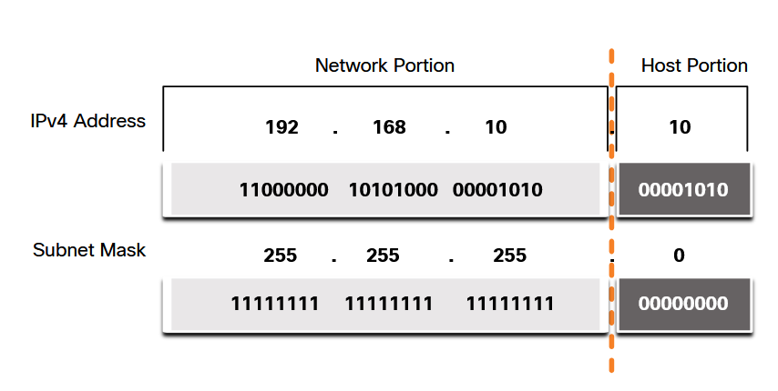

### Prefix length
Expressing network addresses with subnet masks is often a lot. There is an alternative notation called prefix length or CIDR notation.

Classic subnet mask examples:
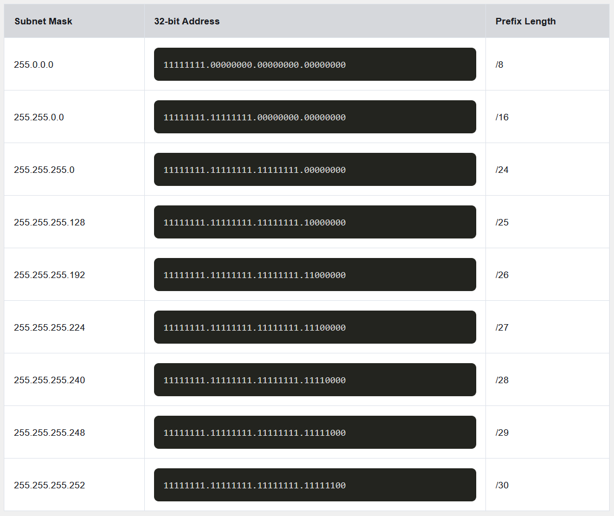

### Network, host and broadcast address
Not all addresses within a network range are usable.

Generally speaking there's always a network address used to identify the (sub)network.
Devices within a specific network meet three criteria:
- They have the same subnet mask as the network address
- They are located within the same broadcast domain as the other hosts with the same network address.

And there's also a broadcast address used to address broadcast messages.

Example 192.168.10.0/24:
- Network address: 192.168.10.0
- Broadcast address: 192.168.10.255
- Host address range: 192.168.10.1 - 192.168.10.254 (254 usable addresses)

To simplify:
- Network address, all **host bits are set to 0**
- Broadcast address, **all host bits are set to 1**
- Host address, the bits after the network portion

## IPv4 Unicast, Broadcast and Multicast
**Unicast** is one-to-one communication, where a packet is sent from a single source to a single destination IP address. Most normal network traffic uses unicast, and the source address is always a unicast address.

**Broadcast** is one-to-all communication within the same broadcast domain. The destination address has all host bits set to 1 (for example `255.255.255.255` or a directed broadcast like `192.168.1.255`). Routers do not forward broadcasts, and excessive broadcast traffic can reduce network performance.

**Multicast** is one-to-many communication, where a packet is sent to a specific group of interested hosts.

Multicast uses addresses in the range `224.0.0.0–239.255.255.255`, and only devices that have joined the multicast group process the traffic (e.g., OSPF using `224.0.0.5`).

## IPv4 address types
### Public and private addresses
**Public** IPv4 addresses are allocated specifcially to be globally routed between ISP routers. However, not all addresses can route to the internet.

There are blocks of addresses called private addresses that are assigned to hosts within a LAN. This was a short-term solution to the IPv4 address depletion, IPv6 is the long-term solution.

Private addresses are defined in RFC 1918 and are referred to as the private address space or blocks.

RFC 1918 Private address space:
- 10.0.0.0/8
- 172.16.0.0/12
- 192.168.0.0/16 (most common)

### Routing to the internet using NAT
When hosts on a private network send traffic to the internet, they use private IP addresses (for example `192.168.0.x`), which are not routable on the public internet. Before the traffic is forwarded to the ISP, the edge router translates the private source address into a public address using Network Address Translation (NAT).

This NAT process happens **on the router that connects the internal network to the ISP**, allowing return traffic to be mapped back to the correct internal host. Public web servers have public IPv4 addresses and are reachable from the internet, they may be placed in a **demilitarized zone (DMZ)**, which is a network segment designed to expose services while isolating them from the internal network.

### Special-use addresses: Loopback & APIPA
Special-use addresses have **restricted** purposes and are not assigned for normal host communication.

Loopback addresses (**127.0.0.0/8**, commonly 127.0.0.1) send traffic back to the local host and are used to test the local TCP/IP stack and services.

Link-local **Automatic Private IP Adressing (APIPA)** addresses are in the (**169.254.0.0/16**) range. Windows systems automatically assign these addresses when no DHCP server is available, allowing only local network communication.

### Legacy classful addressing
In 1981 the [RFC 790](https://datatracker.ietf.org/doc/html/rfc790) defined IPv4 addresses to use classful addressing. Assigned numbers customers were allocated addressed based on three classes:
- Class A, 0-127/8 (16 million hosts each network)
- Class B, 128-191/16 (65000 hosts each network)
- Class C, 192-223/24 (254 hosts each network)
- Class D, 224-239 (multicast block)
- Class E, 240-255 (experimental block)


### Assignment of IP addresses
The Internet Assigned Numbers Authority (IANA) manages and allocates blocks of IPv4 & IPv6 addresses to the Regional Internet Registries (RIRs).

The RIRs are responsible for allocating the IP addresses back to the ISPs.

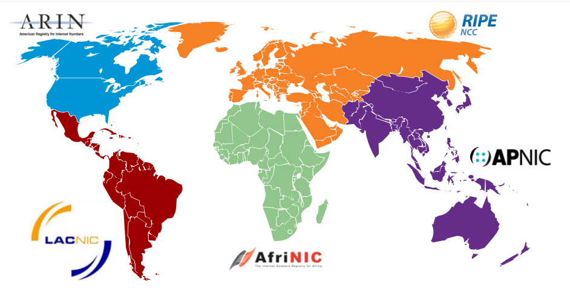

## Network segmentation
### Broadcast domains and segmentation
Broadcast messages are similar to sending an email to everyone in a company, even though most recipients do not need the information.

On a LAN, devices use broadcasts for functions such as ARP and DHCP. Layer 2 switches forward broadcast frames out of all ports except the one they were received on.

Routers do not forward broadcast traffic. As a result, **each router interface forms a separate broadcast domain**, which is the basis for network segmentation.

### Problems with large broadcast domains
Large broadcast domains can generate excessive broadcast traffic, which degrades network performance and slows communication.

This problem is addressed by **subnetting**, which divides a network into **smaller broadcast domains** called subnets.

Subnetting works by **increasing the prefix length** (for example from `/16` to `/24`), **borrowing bits** from the host portion of the address to create additional subnets.

### Reasons for segmenting networks
- Reduce overall network traffic
- Enforce security policies by controlling which subnets - can communicate
- Limit the size of broadcast domains

Networks can be segmented in different ways, such as:
- By physical location, like floors or buildings
- By organizational function, such as students or human resources
- By device type, such as printers, servers, or user devices


## IPv4 subnetting
> Disclaimer:
> 
> Subnetting is such a broad topic. We highly recommend practicing and using other resources as we won't go into depth.

Subnetting divides a network into smaller networks by **borrowing bits from the host portion** of an IPv4 address and extending the subnet mask. Borrowing more bits creates **more subnets**, but **fewer hosts per subnet**.

Subnetting is easiest on **octet boundaries** (`/8`, `/16`, `/24`). For example, the network `10.0.0.0/8` can be subnetted into /16 networks to create 256 subnets with about 65,000 hosts each, or into `/24` networks to create over 65,000 subnets with 254 hosts each.

Subnetting can also occur **within an octet** by using longer prefixes such as `/25` through `/30`. Each borrowed bit **doubles the number of subnets** and **halves the number of usable hosts**, allowing flexible network designs based on host requirements.

## Subnet to meet requirements
Organizations use private IPv4 addresses for internal networks (intranet) and public IPv4 addresses for internet-facing systems like those in a DMZ. Private address space (such as `10.0.0.0/8`) is **plentiful** and flexible, making subnetting easier and allowing growth using common prefixes like `/16` or `/24`.

Public IPv4 addresses are **limited**, so they must be used efficiently. To avoid wasting addresses, administrators use **Variable Length Subnet Masking (VLSM)**, which assigns different subnet sizes **based on actual host requirements**. The largest subnet determines how many host bits are needed, and the remaining bits are used to create enough subnets while allowing room for future expansion.

## VLSM (Variable-Length Subnet Masking)
VLSM was developed to address the inefficiency of traditional subnetting, where all subnets are the same size regardless of actual host needs. With VLSM, networks can be divided into **unequal-sized subnets**, allowing address space to be used more efficiently, which is especially important for limited public IPv4 addresses.

### Why it's needed
Traditional subnetting uses a single subnet mask, often leading to wasted addresses when smaller networks (like point-to-point WAN links) are given far more host addresses than required. VLSM solves this by allowing different subnet masks within the same network.

### IPv4 address conservation
Because IPv4 address space is scarce, especially for public addresses, conserving host addresses is critical. VLSM minimizes unused addresses by tailoring each subnet size to its specific host requirement. This problem does not exist with IPv6 due to its vastly larger address space.

### VLSM concept
VLSM allows **subnetting a subnet**. Instead of assigning `/27` to every network, larger subnets are kept for LANs, while one `/27` subnet is further divided into multiple `/30` subnets for point-to-point WAN links. This avoids wasting addresses.

### Traditional subnetting example
Using `192.168.20.0/24`, borrowing 3 bits creates eight `/27` subnets with 30 usable hosts each. While this meets the needs of the largest LANs, it wastes many addresses on WAN links that only require two hosts, resulting in significant unused address space.

### VLSM subnetting example
For example, four `/27` subnets are assigned to LANs based on their host needs. One unused `/27` subnet is then subdivided into eight `/30` subnets, three of which are used for router-to-router links. This approach satisfies all requirements while preserving address space for future growth.

### Key VLSM Rule
When designing a VLSM scheme, always allocate address space starting with the largest subnet first, then progressively subnet for smaller networks until the smallest host requirement is met.

## Structured design
Before subnetting, you plan the entire IPv4 address scheme: how many subnets are needed, how many hosts each requires, and where private vs public addresses are used (intranet vs DMZ). Public address space, especially in the DMZ, must be conserved using VLSM, while private intranets have more flexibility.

Address planning also defines **how IPs are assigned**: clients usually via DHCP, servers and network devices statically, and routers act as gateways using predictable addresses. A consistent addressing pattern makes management, security, and growth much easier.

# IPv6 addressing
## IPv6 issues
### The need for IPv6
IPv6 addresses have a 128-bit address space, providing 340 undecillion possible addresses.

IPv6 doesn't only include more address space but the IETF fixed certain IPv4 limitations that IPv6 doesn't have. ICMPv6 for example, it includes address resolution and autoconfiguration which ICMPv4 doesn't include.

All five RIRs have ran out of addresses between the years 2011 and 2020.

### IPv4 and IPv6 coexistence
As of today there is no specific date to move to IPv6. Both versions coexists and the transition will take many more years to come.

The IETF has created various protocols and tools to help network administrators migrate their networks to IPv6:
- Dual Stack: both versions are natively in use
- Tunneling: a way to transport an IPv6 packet over an IPv4 network
- Translation (NAT64): Allows both versions to communicate by translating packets to addresses similar to NAT.

## IPv6 address representation
IPv6's 128 bits are written as a string of hexadecimal characters. Every hexadecimal character represents 4 bits, totaling 32 hexadecimal characters.  


### IPv6 addressing preffered formatting using hextets
The previous figure also shows that the preferred format for writing an IPv6 address is `xxxx:xxxx:xxxx:xxxx:xxxx:xxxx:xxxx:xxxx`.

The term octet refers to the eight bits of an IPv4 address. In IPv6, a hextet is the unofficial term used to refer to a segment of 16 bits, or four hexadecimal values.

Examples:
```terminaloutput
2001 : 0db8 : 0000 : 1111 : 0000 : 0000 : 0000: 0200  
2001 : 0db8 : 0000 : 00a3 : abcd : 0000 : 0000: 1234  
2001 : 0db8 : 000a : 0001 : c012 : 9aff : fe9a: 19ac  
2001 : 0db8 : aaaa : 0001 : 0000 : 0000 : 0000: 0000  
fe80 : 0000 : 0000 : 0000 : 0123 : 4567 : 89ab: cdef  
fe80 : 0000 : 0000 : 0000 : 0000 : 0000 : 0000: 0001  
fe80 : 0000 : 0000 : 0000 : c012 : 9aff : fe9a: 19ac  
fe80 : 0000 : 0000 : 0000 : 0123 : 4567 : 89ab: cdef  
0000 : 0000 : 0000 : 0000 : 0000 : 0000 : 0000: 0001  
0000 : 0000 : 0000 : 0000 : 0000 : 0000 : 0000: 0000  
```

### Rule 1: Omit Leading Zeros
The first rule to help reduce the notation of IPv6 addresses is to omit any leading 0s (zeros) in any hextet.

Example:
```terminaloutput
Preferred format = 2001 : 0db8 : 0000 : 1111 : 0000 : 0000 : 0000: 0200  
No leading 0s = 2001 : db8 : 0 : 1111 : 0 : 0 : 0 : 200
```

### Rule 2: Double Colon
The second rule to help reduce the notation of IPv6 addresses is that a double colon (::) can replace any single, contiguous string of one or more 16-bit hextets consisting of all zeros.

Example:
```terminaloutput
Preferred format = 2001 : 0db8 : 0000 : 1111 : 0000 : 0000 : 0000: 0200  
No leading 0s = 2001 : db8 : 0 : 1111 : 0 : 0 : 0 : 200
Double colon = 2001 : db8 : 0 : 1111 : : 200
Compressed / no spaces = 2001:db8:0:1111::200
```

## IPv6 address types
### Unicast, multicast and anycast
Unicast: the unique interface identifier
Multicast: An IPv6 multicast address used to send a single packet to multiple destinations.
Anycast: An IPv6 address that can be assigned to multiple devices. A packet sent to an anycast address is routed to the nearest device containing this address.

### IPv6 prefix length
With IPv6 there is no dotted-decimal subnet mask notation like IPv4 has.

The prefix length can range from 0-128 with the recommended LAN prefix being `/64`. This is strongly recommended because SLAAC uses 64 bits for the interface ID.

### Unicast address types
- Global Unicast Address (GUA), similar to public IPv4 addresses. Theses are globally unique internet-routable addresses.
- Link-local Address (LUA), these are used to communicate with other devices on the same local link. With IPv6 **link refers to a subnet**. LLAs are confined to a single link, therefor they must only be unique to that link.
- Loopback address, `::1/128`
- Unspecified address, `::`
- Unique local address, `fc00::/7` - `fdff::/7`
- Embedded IPv4 address

### Unique local addresses
Unique local addresses are not yet commonly implemented in current-day networks. They may at some day be IPv6's version of RFC 1918 private addresses.

### IPv6 GUAs & structure
Currently the ICANN, IANA's operator only allocates from the `2000::/3` range (first three bits 001). These addresses are globally routable on the internet.

Structure:
| Global Routing Prefix | Subnet ID | Interface ID |
|-|-|-|
| 48 bits (12 hex chars) | 16 bits (4 hex chars) | 64 bits (16 hex chars) |


The **global routing prefix** is the globally unique network portion of the address. It is allocated by IANA to RIRs and assigned to organizations by ISPs. It identifies the organization on the internet.
- Size: commonly `/48` but can be `/32`, `/40`, `/56`, etc.
- Used by **internet** routers
- Equivalent to the public IPv4 network portion
- Example" `2001:0db8:acad::/48`

The **subnet ID** identifies internal subnets within the organization and is used for network segmentation, similar to IPv4 subnetting.
- Size: typically 16 bits
- Lets you design internal networks cleanly
- Every subnet is usually a `/64`
- Example" `2001:0db8:acad:0001::/64`

The **interface ID** identifies a **single interface on a subnet** and must be unique within the /64. It is similar to the host portion in IPv4.
- Size: always 64 bits
- Assigned by:
  - SLAAC
  - DHCPv6
  - Static configuration

### IPv6 LLA
A Link-Local Address (LLA) is an IPv6 unicast address used only for communication on the local link (subnet).
An IPv6 link refers to a **single Layer-2 network**, such as an Ethernet segment or VLAN.

- LLAs are **not routable** and **never leave the local link**.
- Prefix: `fe80::/10`
- In practice: `fe80::/64`
- Every IPv6-enabled interface **automatically generates** an LLA
- Example: `fe80::a00:27ff:fe4e:66a1`

## GUA & LLA static configurations
### IPv6 static GUA configuration on a router
```terminaloutput
R1(config)# interface gigabitethernet 0/0/0
R1(config-if)# ipv6 address 2001:db8:acad:1::1/64
R1(config-if)# no shutdown
R1(config-if)# exit
R1(config)# interface gigabitethernet 0/0/1
R1(config-if)# ipv6 address 2001:db8:acad:2::1/64
R1(config-if)# no shutdown
R1(config-if)# exit
R1(config)# interface serial 0/1/0
R1(config-if)# ipv6 address 2001:db8:acad:3::1/64
R1(config-if)# no shutdown
```

### IPv6 static LLA configuration on a router
```terminaloutput
R1(config)# interface gigabitethernet 0/0/0
R1(config-if)# ipv6 address fe80::1:1 link-local
R1(config-if)# exit
R1(config)# interface gigabitethernet 0/0/1
R1(config-if)# ipv6 address fe80::2:1 link-local
R1(config-if)# exit
R1(config)# interface serial 0/1/0
R1(config-if)# ipv6 address fe80::3:1 link-local
R1(config-if)# exit
```

## Dynamic addressing for IPv6 GUAs
Most IPv6 devices obtain their **Global Unicast Addresses dynamically** instead of using static configuration. This process relies on **ICMPv6 Router Advertisement (RA)** and **Router Solicitation (RS)** messages, and may involve **SLAAC**, **stateless DHCPv6**, or **stateful DHCPv6**.

Router Advertisements control how IPv6 devices obtain addressing information, while SLAAC, stateless DHCPv6, and stateful DHCPv6 determine who builds the address and who manages the data.

### RS and RA messages
IPv6 dynamic addressing uses **ICMPv6** messages.

- **RS (Router Solicitation)**: Sent by hosts to all IPv6 routers to request addressing information.

- **RA (Router Advertisement)**: Sent periodically by routers (every ~200 seconds) or in response to an RS. RAs are only sent if IPv6 routing is enabled using: `ipv6 unicast-routing`.

RA messages may include:
- Network prefix and prefix length
- Default gateway (router’s **LLA**)
- DNS server addresses and domain name
- Flags indicating which addressing method to use

The RA message is a **suggestion** and the host OS decides how to configure itself.

### RA methods
There are three RA methods, determined by flags set in the RA.

#### Method 1: SLAAC
**Stateless Address Autoconfiguration (SLAAC)** allows a device to configure its own GUA without DHCPv6.

Why is it stateless?:
- No DHCPv6 server
- No address tracking
- Interface ID is created using **EUI-64** or **random 64-bit generation**

How it works:
1. Router advertises prefix and prefix length
2. Host generates its own interface ID
3. Address is formed as: `prefix + interface ID`

#### Method 2: SLAAC & Stateless DHCPv6
This method combines SLAAC with a **stateless DHCPv6 server**.

RA instructs the host to:
- Use SLAAC to create its GUA
- Use the router’s LLA as the default gateway
- Contact a stateless DHCPv6 server for:
  - DNS server addresses
  - Domain name

Important:
- Stateless DHCPv6 does **not** assign IPv6 addresses
- It only supplies additional configuration information

#### Method 3: Stateful DHCPv6
This method uses **stateful** DHCPv6, similar to IPv4 DHCP.

RA instructs the host to:
- Use the router’s LLA as the default gateway
- Obtain all addressing information from a stateful DHCPv6 server

Stateful DHCPv6 provides:
- GUA
- Prefix length
- DNS server addresses
- Domain name

Key distinction:
- The default gateway is never provided by DHCPv6
- It always comes from the RA message

### EUI-64 process vs. randomly generated
When SLAAC is used (Method 1 or 2), the host must generate its own interface ID.

Two options:
- EUI-64 process (based on MAC address)
- Random 64-bit interface ID (privacy-focused)

The prefix always comes from the RA message.

### EUI-64 process
The EUI-64 process creates a 64-bit interface ID from a 48-bit MAC address.

Steps:
1. Split MAC into:
   - 24-bit OUI
   - 24-bit device identifier
2. Insert fffe in the middle
3. Flip the U/L bit (7th bit)

Result:
- A predictable interface ID
- Often recognizable by `fffe` in the middle

Advantages:
- Easy device identification
- Simplifies troubleshooting

Disadvantage:
- Privacy concerns (device tracking)


### Randomly generated inteface IDs
Modern operating systems (e.g., Windows Vista and later) prefer **random interface IDs**.

- Not based on MAC address
- Improves user privacy
- Still combined with RA prefix to form the GUA

Both EUI-64 and random IDs are verified using Duplicate Address Detection (DAD) to ensure uniqueness.

## Dynamic addressing for IPv6 LLAs
**Every IPv6 interface** must have a Link-Local Address (LLA).
An LLA is usually created automatically, not manually.

A dynamically generated LLA has two parts:

Prefix: `fe80::/10`:
- This identifies the address as link-local
- In practice, LLAs are used with /64

Interface ID (64 bits), generated in one of two ways:
- EUI-64 (derived from the interface’s MAC address)
- Random 64-bit value (privacy-focused)

Structure: `fe80:: + 64-bit interface ID`

### Dynamic LLAs on Windows hosts
Operating systems like Windows typically use the same interface ID for:
- The global unicast address (GUA) created via SLAAC
- The link-local address (LLA)

Windows may use:
- EUI-64
- A random 64-bit interface ID

The right half is identical, only the prefix changes.

Example:
```terminaloutput
IPv6 Address:        2001:db8:acad:1:XXXX:XXXX:XXXX:XXXX
Link-local Address:  fe80::XXXX:XXXX:XXXX:XXXX
```

### Dynamic LLAs on Cisco routers
On Cisco routers an LLA is automatically created as soon as a **GUA is assigned** to the interface.

By defaukt the Cisco IOS uses **EUI-64** to generate the interface ID.

There's special cases where the serial interfaces have no MAC address. Here the Cisco IOS will reuse the MAC address from an Ethernet interface. This is allowed because LLAs **only need to be unique on the local link**.

The downside is:
- EUI-64 LLAs are long and hard to recognize
- Routers often use manually configured LLAs instead

### Verify IPv6 address configuration
When you see an interface you usually see two IPv6 addresses if configured right:
- LLA, `fe80::…`
- GUA, `2001:db8:…`

On Cisco routers you can use the `show ipv6 interface brief` command, similar to the IPv4 variants. This will show a brief overview of everything we need to know about the interface.

We can also use the `show interface <interface>` command to get an overview of a specific interface.

Important:
- LLAs are **automatically added**
- LLAs can be **reused across different links**
- GUAs must be **globally unique**

Similar to IPv4 we have:
- `show ipv6 route`, to show the routing table
- `ping <ipv6 address>`

## IPv6 Multicast addresses
IPv6 uses **multicast instead of broadcast**.
Multicast means one packet is sent to many receivers at once.

All IPv6 multicast addresses start with `ff00::/8`. There can be **destination addresses** only, never a source.

They key idea here remains: multicast is **how IPv6 devices discover routers and configure themselves**.

IPv6 has two important multicast types:
- Well-known multicast addresses
- Solicited node multicast addresses

### Well-known multicast addresses
These are predefined groups that devices automatically join. They are **used by core IPv6 protocols** (ICMPv6, SLAAC, DHCPv6).

**All-nodes multicast, `ff02::1`**:
- Every IPv6-enabled device joins this group
- Sending to this address = “everyone on this link”
- Replaces IPv4 broadcast
- Routers send Router Advertisements (RA) to this address

**All-routers multicast, `ff02::2`**:
- Only IPv6 routers join this group
- Hosts send Router Solicitation (RS) messages here
- Routers respond with RA messages

### Solicited node multicast addresses
A solicited-node multicast address is a special multicast address created for each IPv6 unicast address.

Used mainly for Neighbor Discovery (ND), IPv6’s replacement for ARP.

It exists to avoid asking every device: "Who has this IP?". Instead, IPv6 asks a smaller multicast group.

Improvements:
- Maps directly to an Ethnernet multicast MAC
- Allows NIC hardware to filter traffic
- Most packets are dropped before reaching the IPv6 stack
- Less CPU usage
- Less unnecessary processing
- Much more scalable than IPv4 ARP broadcasts

## IPv6 subnetting
> Disclaimer:
> 
> Subnetting is such a broad topic. We highly recommend practicing and using other resources as we won't go into depth.

# ICMP
ICMP (Internet Control Message Protocol) is used to test, verify, and troubleshoot network connectivity.

ICMP doesn’t carry application data. It carries **error reports and diagnostic information** so we can see what’s wrong in the network.

## ICMP messages
IP is a **best-effort** protocol. It does not guarantee delivery or report problems by itself.
ICMP exists to send feedback about IP packet delivery issues and network status.
It does not make IP reliable, it only reports errors and status.

ICMP exists for both IP versions. ICMP's messages are often considered optional and filtered for security reasons.

### Host reachability (Echo)
The ICMP Echo message is used to test if a host is reachable:
1. Sender sends **echo request**
2. Receiver replies with **echo reply**

This is the essence of how the `ping` command works.

### Destination or service unreachable
The ICMP Destination Unreachable message is sent when a packet cannot be delivered. The message includes a **code** explaining why it failed.

ICMPv4:
- Net unreachable
- Host unreachable
- Protocol unreachable
- Port unreachable

ICMPv6:
- No route to destination
- Administratively prohibited (firewall)
- Address unreachable
- Port unreachable

### Time exceeded
The ICMP Time Exceeded message is sent when a **packet expires before reaching its destination**:
- IPv4 uses **TTL (Time To Live)**
- IPv6 uses **Hop Limit**
- Each router decrements the value by 1
- When it hits 0, the **packet is dropped** and ICMP replies

### ICMPv6-specific messages
CMPv6 does much more than ICMPv4. It replaces ARP and supports IPv6 autoconfiguration.

These messages are part of **Neighbor Discovery (ND / NDP)**.

**Between router and host**:
- RS (Router Solicitation), where the host asks: "Any routers here?"
- RA (Router Advertisement), where the router replies with:
  - Prefix
  - Prefix length
  - DNS info
  - Default gateway (router's link-local address)
- RA messages are sent every 200 seconds to `ff02::1` (**all-nodes multicast**) and used by SLAAC.

**Between host and host**:
- NS (Neighbor Solicitation), where the host asks "Who has this IPv6 address?"
- NA (Neighbor Advertisement), where another host replies with "I do."
- Used for address resolution and Duplicate Address Detection (DAD)

## Ping & Traceroute testing
Ping and traceroute are basic network troubleshooting tools that use ICMP to **test connectivity** and diagnose problems in IPv4 and IPv6 networks.

### `ping`
Ping tests whether two hosts can communicate by using the ICMP Echo Request and ICMP Echo Reply.

It also:
- Measures the **round-trip time (RTT)** which is a rough indicator of performance.
- Has a **timeout** if no reply is received
- A **success/failure rate report**
- An **average RTT report**

Common TCP/IP verification tests include:
1. Loopback pinging:
   - IPv4, `ping 127.0.0.1`
   - IPv6, `ping ::1`
2. Default gateway pinging:
  - See if local hardware works (NIC, cabling, switches, etc.)
  - See if the router interface is reachable and not blocking ICMP
3. Remote host pinging:
   - Verifies the remote host functionality
   - Verifies if the state of the host is up and running
   - Verifies if ICMP isn't blocked by security policies
   - Test communication across networks / routing

### `traceroute`
The `traceroute` exploits the IPv4 **TTL** and the IPv6 **Hop Limit**. In combination with the ICMP **Time Exceeded** messaging.

How it works:
1. Sends packets with **TTL = 1**, the first router replies with Time Exceeded
2. Increase the TTL to reveal each router in the path.
3. Stop when the destination responds with either a **ICMP Echo Reply** or **ICMP Port Unreachable** message.

# Transport layer
## Transport of data
The transport layer is responsible for **end-to-end communication between applications running on different hosts**. It sits between the **application layer** and the **internet layer**, acting as the bridge that moves application data across the network.

It only cares about **getting data from one application to another**.

### Role of the transport layer
The transport layer:
- Provides logical communication between applications
- **Establishes temporary sessions** if needed
- Handles how data is delivered to the destination application

In the TCP/IP model:
- Applications talk to **TCP** or **UDP**
- **TCP/UDP hand data to IP**
- IP handles addressing and routing

### Transport layer responsibilities
1. **Tracking conversations**, each communication between a source application and destination application is a separate conversation:
- Keeps conversations separate
- Allows multiple applications to communicate at the same time
- Ensures data goes to the correct application

2. **Segmentation and reassembly of segments**, networks limit packet size, so large data must be split:
- Breaks application data into smaller pieces
- Sends them separately
- Reassembles them at the destination (if required)

3. **Adding header information**, this is used by the receiving host to reassemble the blocks of data into a complete data stream.
4. **Identifying the applications**, the transport layers has to be able to separate and manage multiple communications with different needs. It does this by using an identifier called a **port number**.
5. **Conversation multiplexing**, sending large amounts of data like a video across a network as one complete stream can consume all the available bandwidth. Mutliplexing enables different conversations to be interleaved on the same network.

### Transport layer protocols
IP only **moves** packets, it does not ensure delivery.

The transport layer decides **how reliable delivery should be**.

Two protocols exist to match different application needs:
- **TCP**, reliable
- **UDP**, fast and lightweight

## TCP
TCP is **reliable** and **connection-oriented**.
TCP is **stateful** meaning that it tracks data about the state of a packet. It then **adds this data to the packet header** before sending it out.

### TCP features
1. Before sending real data, TCP **sets up a session between** the two hosts. This session is established by a **3-way handshake**. This is also the reason why TCP is called connection-oriented.
2. Networks can be messy: segments can be lost, corrupted or might never arrive. **TCP ensures reliable delivery by expecting acknowledgements (ACKs).** Anything that isn't acknowledged will be retransmitted.
3. TCP **keeps track of the packet order**. Some packets might arrive out of order. TCP fixes this by assigning **sequence numbers** to segments and reassembling the data in the correct order at the destination.
4. Receivers might have limited memory, CPU, etc. If the receiver is overwhelmed TCP will tell the sender to **slow down**. The key idea here is to provide **flow control** by adapting to the receiver's capacity.

### TCP header fields
TCP has a 10-field, 20-byte header.

- **Source port & destination port**, identify which applications are talking
- **Sequence number**, the byte number to order the data stream 
- **Acknowledgment number**, used to indicate that data has been received and the next expected byte from the source
- Header length, this field is also known as the "data offset" used to indicate the length of the TCP segment header.
- Control bits / flags:
  - **Start connection (SYN)**
  - **Acknowledge data (ACK)**
  - **End connection (FIN)**
  - **Abort connection (RST)**
- Window size, a flow control field in order to know the size of packet data that TCP is able to send before having to wait on the receiving device.
- Checksum, for error detection
- Options, extra capabilities (like window scaling)
- Urgent, a indicator used if the contained data is urgent

### TCP use cases
TCP is mostly used when data has to arrive in complete order without any data missing.

Examples:
- Web (HTTP/HTTPS)
- Email (SMTP, IMAP)
- File transfers (FTP, SMB, SAMBA)
- Secure remote access (SSH)
- Databases
- Banking applications

## UDP
UDP is fast, **connectionless**, **stateless** and **best-effort**. UDP delivers data to the correct application, nothing more.

### UDP features
What UDP does:
1. It segments and reassembles data just like TCP does.
2. It performs very basic error checking through its checksum field.

What UDP does **NOT** do:
- Establish a session
- Retransmit lost segments
- Guarantee ordering
- Flow control
- Send feedback to the sender

### UDP header fields
UDP has a 4-field, 8-byte header.

- **Source port & destination port**
- **Length**, indicates the size of the UDP header and its data.
- **Checksum**, for basic error detection

### UDP use cases
UDP is mostly used where speed matters and minimal overhead is required. Small losses are acceptable and delay would be worse than missing data.

Examples:
- Live Video & Audio (VoIP)
- Simple Request / Reply Applications (DNS, DHCP)
- Applications That Handle Reliability Themselves (TFTP, SNMP)

## Port numbers
TCP and UDP both use **port numbers** to identify applications involved in communication, regardless of the type of data being sent. Port numbers allow a single host to manage **multiple simultaneous conversations**.

### Multiple seperate communications, multiplexing
TCP and UDP use **source and destination port numbers** (16 bits each) in their headers to distinguish between different application conversations.

- The source port identifies the originating application on the local host and is usually **dynamically generated**.
- The destination port **identifies the service requested on the remote host** (e.g., port 80 for HTTP, port 21 for FTP).

Because each conversation uses a different source port, a host can maintain many connections at the same time. Servers can also offer multiple services simultaneously, each listening on a different well-known port.

### Socket pairs
Port numbers are carried in transport-layer segments, which are encapsulated inside IP packets containing source and destination IP addresses.

- A **socket** is the **combination of an IP address and a port** number (e.g., `192.168.1.5:1099`).
- A **socket pair** uniquely **identifies a connection** and consists of the **client socket and the server socket** (e.g., `192.168.1.5:1099` and `192.168.1.7:80`).

Sockets allow:
- Multiple client processes to distinguish their connections.
- Servers to manage multiple connections to the same service.

The **source port acts as a return address**, allowing responses to be delivered to the correct application.

### Port number groups
The Internet Assigned Numbers Authority (IANA) manages the 16-bit port number space, which ranges from **0 to 65535**.

Some applications like DNS use **both TCP and UDP**.

IANA divides ports into three groups:
- well-known, 0-1023
  - FTP, 20 + 21
  - SSH, 22
  - Telnet, 23
  - SMTP, 25
  - DNS, 53
  - DHCP, 67 + 68
  - TFTP, 69
  - HTTP, 80
  - POP3, 110
  - SNMP, 161
  - HTTPS, 443
- registered, 1024-49151
- dynamic/private, 49152-65535

Some client operating systems may use registered ports instead of dynamic ports for source port assignment.

### `netstat`
Unexpected TCP connections can **indicate security risks**, making it important to inspect active connections on a host.

Netstat displays:
- Protocols in use
- Local and foreign addresses
- Port numbers
- Connection states (e.g., ESTABLISHED)

By default, netstat resolves IP addresses and ports to names.
Using the `-n` option displays numerical IP addresses and port numbers instead.

Example:
```terminaloutput
C:\> netstat
Active Connections
  Proto  Local Address          Foreign Address            State
  TCP    192.168.1.124:3126     192.168.0.2:netbios-ssn    ESTABLISHED
  TCP    192.168.1.124:3158     207.138.126.152:http       ESTABLISHED
  TCP    192.168.1.124:3159     207.138.126.169:http       ESTABLISHED
  TCP    192.168.1.124:3160     207.138.126.169:http       ESTABLISHED
  TCP    192.168.1.124:3161     sc.msn.com:http            ESTABLISHED
  TCP    192.168.1.124:3166     www.cisco.com:http         ESTABLISHED
(output omitted)
C:\>
```

## TCP communication process
TCP uses port numbers, control flags, and well-defined procedures to establish, manage, and terminate reliable communication sessions between hosts.

### TCP server processes
Each server-side application process is assigned a **unique port number**, either automatically or by an administrator.

- A single server **cannot assign the same port to multiple services** within the same transport protocol.
- **A server application listening on a port is considered open**, meaning it will accept and process incoming TCP segments addressed to that port.
- Servers can have **many open ports simultaneously**, one per active service.

Clients use **dynamically assigned source ports** to request services:
- Example: one client requests HTTP (destination port 80), another requests SMTP (destination port 25) from the same server.
- TCP uses port numbers to deliver each request to the correct server application.

### TCP connection establishment
TCP connections are established using the **three-way handshake**, which ensures both hosts are ready to communicate.

1. **SYN**: The client initiates a connection by sending a segment with the **SYN flag** set.
2. **SYN, ACK**: The server acknowledges the client-to-server communication and requests to start a session.
3. **ACK**: The client acknowledges the server-to-client session.

### Session termination
To close a connection the **finish or FIN control flag** must be set in the segment header. Next to end each one-way TCP session, a two-way handshake is initiated.

1. **FIN**: The client initiates an end to the session by sending a segment with the **FIN flag** set.
2. **ACK**: The server acknowledges the receipt to terminate the session.
3. **FIN**: The server again sends a segment with the FIN flag set.
4. **ACK**: The client now acknowledges the FIN from the server and knows that the data stream is closed.

### TCP Three-way handshake analysis
TCP is a **stateful, full-duplex protocol** that tracks sequence numbers and acknowledgments for reliability.

The control bits / flags field contains 6 flags that indicate connection state:
- **URG**, Urgent pointer is valid
- **ACK**, Acknowledgment field is valid (used in setup and termination)
- **PSH**, Push data immediately to the application
- **RST**, Reset the connection due to error or timeout
- **SYN**, Synchronize sequence numbers (connection setup)
- **FIN**, Sender has no more data (session termination)


## Reliability and flow control
TCP provides reliability by ensuring **guaranteed delivery**, **correct ordering**, **retransmission of lost data**, and **controlled data flow** so that receivers are not overwhelmed.

### Guaranteed and ordered delivery
Each TCP segment includes a sequence number, which identifies the first byte of data in that segment. During session setup, an **Initial Sequence Number (ISN)** is established and then incremented as data is transmitted.

This allows TCP to:
- Detect missing data
- Identify duplicate segments
- Reassemble in the correct order

ISNs are effectively **random to reduce security risks**, though simplified values are often used for learning examples.

TCP segments may take **different network paths** and arrive **out of order**:
- The receiving TCP process stores incoming data in a **buffer**
- Segments are held until missing data arrives
- Data is then reordered using sequence numbers and delivered to the application layer in correct order

### Data loss and retransmission
Data loss can occur even on well-designed networks. TCP detects and corrects this using **acknowledgments and retransmissions**.

Older TCP behavior tended to retransmit all data **from the missing segment onward**. This cause unnecessary retransmissions, duplicates, and congestion.

Modern TCP typically uses **Selective Acknowledgement (SACK)**:
- The receiver explicitly reports which data was received
- The sender retransmits only the missing segments
- SACK support is negotiated during the three-way handshake

TCP also uses **timers** to determine when retransmissions are necessary.

Example: `ACK 3, SACK 5-10`, meaning it didn't receive from and including sequence 3 to 4 but did receive sequence 5 through 10.

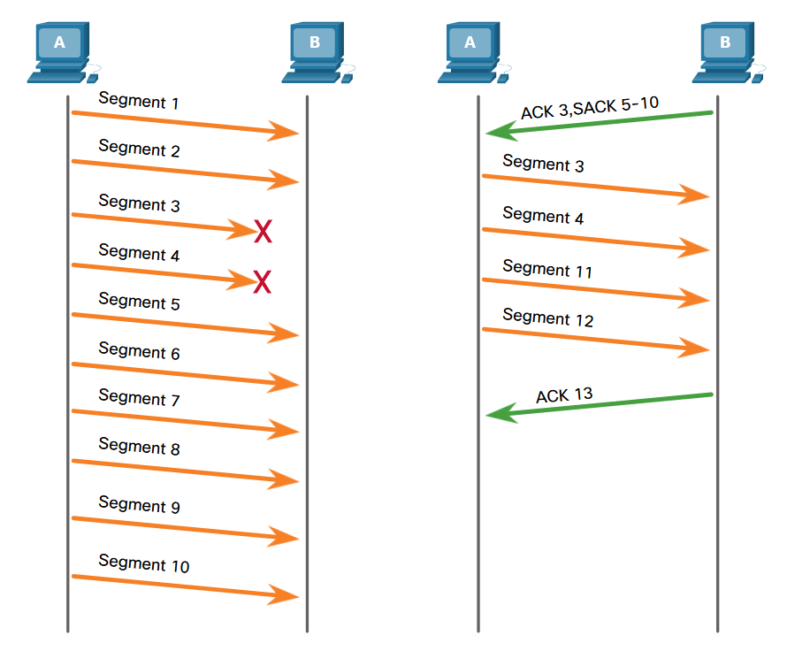

### Flow control, window size and acknowledgements
Flow control ensures the sender does not overwhelm the receiver.

- TCP uses the **window size field** to specify how much data the receiver can accept. Which is the **number of bytes** the sender may transmite **without receiving an ACK**.
- The **ACK number** identifies the next expected byte.
- The window size is also negotiated during the three-way handshake and dynamically adjusted based on buffer availability. This is known as a **sliding window**.

Receivers typically send acknowledgments **before the entire window is filled**, allowing continuous data flow.

Example:
- Initial window size: 10000 bytes
- Maximum Segment Size: 1460 bytes

### Flow control, Maximum Segment Size (MSS)
The **Maximum Segment Size (MSS)** defines the largest amount of application data that can be carried in a single TCP segment.

- Specified in the **TCP options field**
- It **does not include TCP headers**
- Default MSS is **1460 bytes** (= 1500 byte Ethernet MTU - 20 byte IPv4 header - 20 byte TCP header)

### Congestion avoidance
Network congestion occurs when routers drop packets due to overload.

- Lost TCP segments result in **missing acknowledgments**
- The sender interprets **delayed or missing ACKs as congestion**

To prevent congestion collapse:
- TCP reduces the amount of unacknowledged data it sends
- Retransmissions are controlled to avoid worsening congestion
- Congestion control is managed by the **sender**, not the receiver’s window size

## UDP communication process
### UDP Datagram reassembly
UDP datagrams may take different paths through the network and arrive out of order.

- UDP does not use sequence numbers
- It cannot reorder datagrams
- Lost datagrams are not retransmitted

UDP simply delivers data to the application in the order received. If correct sequencing is required, the **application itself must handle ordering and loss detection**.

### UDP Server processes and requests
UDP-based server applications are assigned **well-known or registered port numbers**.

- When a UDP server process is running, it listens on its assigned port
- Incoming datagrams are delivered to the correct application **based solely on the destination port number**

### UDP Client processes
UDP communication is **initiated by a client application**.
- The client selects a **dynamic source port**
- The destination port is the server’s **well-known or registered port**
- The same port pair is used for the entire transaction

For replies the source and destination ports are reversed in the return datagrams. Just like with the TCP segments.

# Application layer
## Application, presentation & session
### Application layer
The application layer is the layer closest to the end user in both the OSI and TCP/IP models:
- It provides the **interface between user applications and the network**
- Application layer protocols define how data is exchanged between programs running on different hosts

In the TCP/IP model, the application layer **combines the functions of the OSI application, presentation, and session layers**.

Common application layer protocols include:
- HTTP
- FTP and TFTP
- IMAP
- DNS
- SMTP, POP, and DHCP

### Presentation layer
The presentation layer is responsible for **how data is formatted and represented**. These standards ensure that data created on one system can be correctly interpreted by another.

Its primary functions are:
- **Formatting** data into a compatible structure for the destination
- **Compressing** data to reduce size
- **Encrypting** data for transmission and **decrypting** it on receipt

This layer defines standards for file formats, such as:
- Video: MKV, MPG, MOV
- Images: GIF, JPG, PNG

### Session layer
The session layer manages communication sessions between applications.
The session layer ensures that communication between applications remains organized and continuous.

Its functions include:
- **Establishing** sessions
- **Maintaining** active dialogs
- **Restarting** sessions that are interrupted or idle for long periods

### TCP/IP application layer protocols
TCP/IP application layer protocols define the **format and control rules** for common internet communications.
- These protocols are used by **both source and destination hosts**
- For communication to succeed, both hosts must support **compatible application layer protocols**

## Peer-to-Peer
Network communication at the application layer can follow either the **client-server model** or the **peer-to-peer (P2P) model**, depending on how roles and resources are distributed.


### Client-server model
In the client-server model, one device requests services and another device provides them:
- The **client** initiates the request and accesses resources
- The **server** responds to requests and stores or provides data
- Client and server processes operate at the **application layer**

Application layer protocols define:
- Request and response formats
- Authentication methods
- File identification and transfer procedures

A common example is email:
- The email client requests unread messages from an ISP mail server
- The server delivers the requested data
- Client-to-server transfers are **uploads**
- Server-to-client transfers are **downloads**

### Peer-to-Peer networks
In a peer-to-peer (P2P) network, devices communicate **directly with each other** without a dedicated server.

- Each device (peer) can act as both **client and server**
- Roles are assigned **per request**, not permanently
- Resources such as files, printers, and internet access can be shared

Peers are considered **equal participants** in communication. A device may provide a service in one exchange while consuming a service in another at the same time.

### Peer-to-Peer applications
A **P2P application** allows a device to function as both a client and a server within the same communication session.

Each peer must provide:
- A **user interface**
- A **background service** to share resources

Some P2P systems use a **hybrid model**:
- Resource sharing is decentralized
- A centralized index server tracks where resources are located
- Peers query the index server, then connect directly to each other

Instant messaging is a common example, where both peers simultaneously send and receive data.

### Common P2P applications
With P2P applications, all participating devices can share and request resources.

Common P2P networks include:
- BitTorrent
- Direct Connect
- eDonkey
- Freenet

Some P2P applications use the **Gnutella protocol**, where peers search each other directly for shared whole files. Popular Gnutella-compatible clients include μTorrent, BitComet, DC++, Deluge, and eMule.

**BitTorrent** uses:
- Torrent files to locate peers
- Trackers to identify who has specific file pieces
- A **swarm**, where peers download pieces from multiple sources simultaneously

## Web & email protocols
### Hypertext Transfer Protocol (HTTP) & Hypertext Markup Language (HTML)
Application layer–specific protocols are designed for common services such as web browsing and email.
HTTP is the protocol used for transferring web content, while HTML defines how web pages are structured and displayed.

When a user enters a **Uniform Resource Locator (URL)** into a web browser, the browser communicates with a web server using HTTP.
URLs and Uniform Resource Identifiers (URIs) are the names commonly associated with web addresses.

### Opening a web page using HTTP
Example URL: http://www.cisco.com/index.html

**Step 1 – URL interpretation:** The browser interprets the three components of the URL.
1. The protocol or scheme: `HTTP` or `HTTPS`
2. The server's domain name: `www.cisco.com`
3. The requested file: `/index.html`

**Step 2 – Name resolution and request:**
1. The browser contacts a DNS server to resolve `www.cisco.com` into a numeric IP address.
2. The client establishes a connection to the server
3. The browser sends an **HTTP GET** request for the `index.html` file


Example request components:
```terminaloutput
Host: www.cisco.com
Method: GET
Resource: /index.html
Protocol version: HTTP/1.1
```

**Step 3 – Server response:** The web server responds.
1. An HTTP response header

Example HTTP response header:
```terminaloutput
HTTP version and status code (e.g., HTTP/1.1 OK)
Date
Server type
Last-modified timestamp
Entity tag (ETag)
Accepted byte ranges
Content-Length
Connection status
The HTML source code for the requested page
```

**Step 4 – Page rendering:** The browser will render the page.
1. Interprets the HTML code
2. Formats the content
3. Displays the web page in the browser window

### HTTP
HTTP is a **request/response protocol**, meaning all communication consists of client requests followed by server responses.

It's important to note that `HTTP has security limitations`:
- Requests are sent in **plaintext**
- Responses are **unencrypted**
- Data can be **intercepted** and read by third parties

Common HTTP request methods:
- `GET`: Used by clients to request data, such as HTML pages
- `POST`: Uploads data to the server, commonly form data
- `PUT`: Uploads or replaces resources, such as images or files

### HTTPS
HTTPS provides secure communication by adding **authentication** & **encryption**.

HTTPS uses the same request/response model as HTTP, but:
- Data is encrypted using **Transport Layer Security (TLS)** or its predecessor **Secure Sockets Layer (SSL)**
- Encryption occurs before data is transmitted across the network

### Email protocols and email communication model
Email is a **store-and-forward** communication method, meaning email messages are stored in databases on mail servers.
1. Sent
2. Stored on servers
3. Retrieved by recipients later

### Email communication overview
- Email **clients do not communicate directly** with each other
- Both sender and receiver **rely on mail servers**
- Mail servers communicate with other mail servers to deliver messages across domains

### Email protocol roles
Email uses three separate application layer protocols:
- SMTP (Simple Mail Transfer Protocol) → sending mail
- POP (Post Office Protocol) → retrieving mail
- IMAP (Internet Message Access Protocol) → retrieving and managing mail

### Simple Mail Transfer Protocol (SMTP)
SMTP is responsible for **sending email messages**.

SMTP message structure:
- Header
  - Sender mail address
  - Recipient mail address
- Body: text

SMTP operation:
- SMTP servers listen on TCP port 25
- The client SMTP process connects to the server SMTP process
- The message is transmitted across the connection

After receiving the message, the server:
- Delivers it locally if the recipient exists on that server
- Otherwise, forwards it to another mail server

Message queuing and retries:
- When the destination server is **offline, busy or cannot accept the message**, the message is placed in a **queue**.
- The server **periodically retries delivery**.
- If delivery fails beyond a **predefined expiration time**, the message is returned as **undeliverable**.

### Post Office Protocol (POP)
POP is used by email clients to **retrieve messages** from a mail server. **POP3** is the most commonly used version.

**POP characteristics:**
- Email is **downloaded to the client**
- Messages are **deleted from the server by default**
- There is **no centralized message storage**

**POP operation:**
- The server listens on TCP port 110
- The client establishes a TCP connection
- The server sends a greeting
- Client and server exchange commands and responses
- The connection is then closed

**Limitations of POP:**
- Because messages are removed from the server:
- Email is stored only on the client
- There is no server-side backup
- POP is **not recommended for environments requiring centralized storage**

### Internet Message Access Protocol (IMAP)
IMAP provides an alternative method for retrieving email.

**IMAP characteristics:**
- Messages remain **stored on the server**
- Clients download **copies** of messages
- The server maintains the authoritative message state

**IMAP features:**
- Users can create **folder hierarchies** on the server
- Folder structures are synchronized with the client
- Deleting a message on the client deletes it on the server
- Multiple devices can access the same mailbox consistently

**IMAP is well-suited for:**
- Multi-device access
- Centralized backups
- Long-term message storage

## IP addressing services
### Domain Name System (DNS)
Purpose of DNS

Network devices communicate using **numeric IP addresses**,
but these are difficult for humans to remember.
DNS was created to **translate human-readable domain names into IP addresses**.

If a server’s IP address changes, users are **not affected**, because the domain name remains the same and DNS simply updates the mapping.
DNS is an **essential application layer service** that makes network communication practical and scalable.

Example:
- Fully Qualified Domain Name (FQDN): `www.cisco.com`
- IPv4 address: `198.133.219.25`

#### DNS operation
name resolution process:
1. The user enters an **FQDN** into a browser.
2. The client sends a **DNS query** to its configured DNS server.
3. The DNS server resolves the FQDN to an IP address.
4. The DNS server sends a **DNS response** back to the client.
5. The client uses the IP address to communicate with the destination server.

#### DNS protocol characteristics
DNS defines:
- Query formats
- Response formats
- Error messages
- Resource record transfers

DNS uses a single message format for:
- Client queries
- Server responses
- Errors
- Server-to-server communication

#### DNS message format and resource records
DNS servers store **resource records**, which map names to data.

Common resource record types:
- **A**, IPv4 address of an end device
- **AAAA**, IPv6 address of an end device (pronounced quad-A)
- **NS**, Authoritative name server
- **MX**, Mail exchange server

When a DNS server receives a query:
1. It first checks its **local records**
2. If unresolved, it queries **other DNS servers**
3. Once resolved, the **result is cached temporarily** to speed up future queries

#### DNS caching & message structure
- DNS servers cache resolved names
- Windows clients also cache DNS results

DNS messages contain four sections:
- **Question**
- **Answer**
- **Authority**
- **Additional information**

This structure is used for all DNS communications.

Cached Windows entries can be viewed with:
```terminaloutput
ipconfig /displaydns
```

#### DNS hierarchy
DNS uses a **hierarchical, distributed database model**.
- The namespace is divided into **zones**
- Each DNS server is responsible for a **specific zone**
- If a DNS server cannot resolve a name in its zone, it forwards the request to another DNS server

This design makes DNS:
- Scalable
- Efficient
- Fault-tolerant

#### Top-level domains (TLDs)
Top-level domains indicate organization type or country:
- `.com`, Business or industry
- `.org`, Non-profit organization
- `.au`, Australia
- `.co`, Colombia

#### `nslookup`
Operating systems like Windows and Linux include the `nslookup` utility for **manual DNS queries**.

Uses of `nslookup`:
- Resolve hostnames to IP addresses
- Troubleshoot DNS problems
- Verify DNS server operation

When `nslookup` starts:
- It displays the **default DNS server**
- Users can manually query hostnames or domains
- The tool supports advanced testing and verification options

Examples:
```terminaloutput
nslookup # this enters nslookup mode
> www.cisco.com
Server:  UnKnown
Address:  10.10.10.1
Non-authoritative answer:
Name:    e2867.dsca.akamaiedge.net
Addresses:  2600:1404:a:395::b33
          2600:1404:a:38e::b33
          172.230.155.162
Aliases:  www.cisco.com
          www.cisco.com.akadns.net
          wwwds.cisco.com.edgekey.net
          wwwds.cisco.com.edgekey.net.globalredir.akadns.net
> exit

nslookup www.cisco.com # this is a direct lookup
Server:  UnKnown
Address:  10.10.10.1
Non-authoritative answer:
Name:    e2867.dsca.akamaiedge.net
Addresses:  2600:1404:a:395::b33
          2600:1404:a:38e::b33
          172.230.155.162
Aliases:  www.cisco.com
          www.cisco.com.akadns.net
          wwwds.cisco.com.edgekey.net
          wwwds.cisco.com.edgekey.net.globalredir.akadns.net
```

### Dynamic Host Configuration Protocol (DHCP)
DHCP **automates the assignment of IPv4 network configuration parameters**, including:
- IP address
- Subnet mask
- Default gateway
- DNS server addresses

This is known as **dynamic addressing**.
The alternative is static addressing, where the administrator manually configures every device.

DHCP ensures:
- Unique IP address assignment
- No duplicate addresses on the network

#### DHCP addressing and leases
- A DHCP server assigns addresses from a configured **address pool**
- Addresses are assigned for a limited time called a **lease**
- When the lease expires or the server receives a **`DHCPRELEASE`**, the address is returned to the pool

Benefits:
- Efficient address reuse
- Supports mobile users
- Minimal administrative overhead

DHCP is preferred on:
- Medium and large networks
- Networks with frequently changing users or devices

#### DHCP server placement
- Enterprise networks: dedicated DHCP servers
- Home networks: DHCP typically runs on the router

Networks often use **both**:
- DHCP for end-user devices
- Static addressing for routers, switches, servers, and printers

Most ISPs use DHCP to assign addresses to customers.

#### DHCP operation (IPv4)
The DHCP process follows **four main steps**:
1. `DHCPDISCOVER`: Client broadcasts a message to locate DHCP servers
2. `DHCPOFFER`: Server offers an IP address lease, this Includes:
    - IP address
    - Subnet mask
    - DNS server address
    - Default gateway
    - Lease duration

3. `DHCPREQUEST`:
   - Client selects an offer and requests that specific lease
   - Identifies the chosen DHCP server

4. `DHCPACK`: Server confirms and finalizes the lease

**Error handling:**
If the offered address is no longer available, the server responds with `DHCPNAK`.
Then the client restarts the process with `DHCPDISCOVER`.

**Lease renewal:**
- Clients must renew leases before expiration
- Renewal is done using `DHCPREQUEST`

#### DHCP for IPv6 (DHCPv6)
DHCPv6 provides similar functionality to DHCPv4, but with an important difference:
- **DHCPv6 does not provide a default gateway**
- The default gateway is learned via **Router Advertisement (RA)** messages

DHCPv6 message types:
- `SOLICIT`
- `ADVERTISE`
- `INFORMATION REQUEST`
- `REPLY`

### File sharing services
#### File Transfer Protocol (FTP)
FTP is an **application layer client/server protocol** used to **upload (push)** and **download (pull)** files between a client and a server over a network.
- Commonly used alongside protocols such as HTTP, email, and DNS
- Designed specifically for **file transfers**, not web content or messaging
- Requires both devices to run FTP-compatible software:
  - **FTP client:** application used by the user
  - **FTP server:** system that stores and provides files

#### FTP connection model
FTP uses **two separate TCP connections** between the client and the server

1. **Control connection (on TCP port 21)**:
   - Established first
   - Used for **commands and responses**
   - Client sends requests such as:
     - Login
     - List directory
     - Upload or download commands
   - **Remains open for the duration of the FTP session**

2. **Data connection (on TCP port 20)**:
   - Established **only when data must be transferred**
   - Used for:
     - File uploads
     - File downloads
     - Directory listings
   - **Created and closed each time data is transferred**

#### FTP data transfer
Data transfer is **bidirectional**.
The direction of transfer **depends on the commands sent over the control connection**.

The client can:
- Download files from the server
- Upload files to the server

#### Server Message Block (SMB)
SMB is a **client/server file and resource sharing protocol** used primarily in Microsoft networks.
SMB uses a **request-response model**, where clients request access and servers respond.

It allows devices to share:
- Files and directories
- Printers
- Serial ports
- Inter-process communication resources (mail slots and APIs)

#### SMB message functions & structure
SMB messages are used to:
- **Start, authenticate, and terminate sessions**
- **Control access to files and printers**
- **Allow applications to send and receive messages between devices**

All SMB messages share a common format consisting of:
- A **fixed-size header**
- A **variable-size parameter section**
- A **variable-size data section**

This consistent structure allows SMB to support multiple resource types using the same protocol.

#### SMB in Microsoft networks
SMB is the foundation of Windows file and print sharing.

Historically, before Windows 2000 SMB relied on non-TCP/IP name resolution.
Nowadays, SMB uses DNS naming and is fully integrated with TCP/IP.

#### SMB resource sharing model
- Servers make shared resources available on the network
- Clients send **SMB requests**
- Servers respond with **SMB responses**

Shared resources can include:
- File systems
- Printers
- Mail slots
- Application interfaces (APIs)

Clients can access these resources **as if they were local** to their own system.

#### SMB file sharing behavior
Clients establish a **long-term connection** to the server.
This differs from FTP, where connections are typically short-lived and task-specific.

Once connected, users can:
- Browse shared folders
- Copy files between computers
- Print to shared printers

Example:
- Copying a file between two Windows PCs using Windows Explorer uses SMB

#### SAMBA
SMB is not limited to Windows.
Linux and UNIX systems use Samba, an SMB-compatible implementation.
Apple macOS also supports SMB for network resource sharing.

This makes SMB a cross-platform file sharing protocol in modern networks.

# Network security fundamentals
## Security threats & vulnerabilities
Modern wired and wireless networks are critical to daily personal and organizational activities.
Intruders who exploit software weaknesses or modify systems to gain access are known as **threat actors**.

Unauthorized access can lead to:
- Network outages
- Loss of productivity
- Theft or destruction of valuable data
- Significant financial damage

### Threat types
Once a threat actor gains access, four major categories of threats may occur:

1. **Information theft:**
   - Unauthorized access to confidential data
   - Information may be used or sold

2. **Data loss and / or data manipulation:**
   - Data loss: destruction of data
   - Data manipulation: altering data records
   - Both compromise data integrity and trust.

3. **Identity theft:**
   - Personal information is stolen to impersonate someone else
   - Fraudulent credit applications
   - Unauthorized purchases
   - Illegal acquisition of documents

4. **Disruption of service:**
   - Prevents legitimate users from accessing network services
   - Often achieved through **Denial of Service (DoS)** attacks

### Vulnerability types
A **vulnerability** is a weakness in a device or network that can be exploited.

1. **Technical Vulnerabilities**: Weaknesses in technology itself.

   - TCP/IP protocol weaknesses
   - Operating system flaws
   - Network equipment weaknesses
   - These are often exploited using malware or network-based attacks.

2. **Configuration Vulnerabilities**: caused by improper system setup.

   - Unsecured user accounts
   - Weak or simple passwords
   - Misconfigured internet services
   - Default security settings left unchanged
   - Incorrectly configured network equipment
   - These are among the most common and preventable vulnerabilities.

3. **Security Policy Vulnerabilities**: poor or missing organizational policies

   - No written security policy
   - Lack of consistent authentication standards
   - Missing logical access controls
   - Unauthorized software or hardware changes
   - No disaster recovery plan
   - Even secure technology fails without proper policies.

### Physical security
Physical security is just as important as logical security.
If an attacker can physically access network equipment, they can:
- Disable systems
- Steal hardware
- Disrupt network operations

1. **Hardware Threats**: physical damage

   - Servers
   - Routers and switches
   - Cabling
   - Workstations

2. **Environmental Threats**:

   - Extreme temperatures
   - Excessive humidity or dryness

3. **Electrical Threats**: power-related issues

   - Voltage spikes
   - Brownouts (low voltage)
   - Electrical noise
   - Complete power loss

4. **Maintenance Threats**: human or procedural errors

   - Electrostatic discharge (ESD)
   - Poor cable management
   - Lack of spare parts
   - Poor labeling

### Physical Security Planning
A physical security plan should be designed and implemented to limit equipment damage and unauthorized access.

Key measures include:
1. Locking equipment rooms and securing all entry points such as: doors, ceilings, floors, vents, and ducts.
2. Monitoring access using electronic logs (control access & log event)
3. Installing and maintaining security cameras

A secure computer room typically includes:
- Controlled access (locked doors, card readers)
- Environmental controls (air conditioning)
- Power protection (UPS systems)
- Separate restricted areas for critical infrastructure

## Network attacks
### Malware types
Malware, malicious software is typically code specifically designed to damage, disrupt, steal or inflict illegitimate actions on data, hosts, networks.

- Viruses: executes a specific unwanted and often harmful function on a computer.
- Worms: a self-replicating virus that spreads across the network from system to system.
- Trojan horses: a virus designed to look like something else such as a legitimate application.

### Reconnaissance attacks
External threat actors can use internet tools, such as `nslookup` and `whois`,
to determine the IP address space assigned to a given entity.
A threat actor may then perform an automated ping sweep using tools such as `fping` or `gping`.

- Internet queries: get the ip from a tool such as `nslookup` or `whois.com`
- Ping sweeps: ping every device in a network to see which one responds
- Port scans: scan te ports of a machine to see which ports maybe open, filtered, closed and running which service and what version


### Access attacks
Access attack export known vulnerabilities in authentication services, ftp services, web services, etc to gain entry to accounts, databases, etc.
They allow a threat actor to gain unauthorized access.

- Password attacks: brute-force attacks, trojan-horse attacks, packet sniffers, etc.
- Trust exploitation: gaining access to a system that trusts everyone in order to laterally move to another system.
- Port redirection: using a compromised system to establish a connection to trusted host.
- Man-in-the-Middle: a threat actors positions themselves between two legitimate systems to read and / or modify data

### Denial of Service (DOS) attacks
- DoS: flooding / overloading a system in order to disrupt network operations
- DDoS: A distributed DoS attack, usually from a network of zombies called a botnet

## Network attack mitigations


### The Defense-In-Depth approach
Defense-in-Depth is the idea that **no single security control is sufficient**.
Instead of relying on one “strong wall,” you layer multiple protections: technical, administrative, and physical.
So that if one layer fails, others still reduce risk.
This includes firewalls, access controls, endpoint protection, monitoring, and policies working together.


### Backups
Backups protect **availability and recoverability, not prevention**.
Even with strong defenses, systems can fail due to ransomware, human error, or hardware loss.
Effective backups follow rules like regular scheduling, offline or immutable storage,
and testing restores, ensuring data can actually be recovered when needed.

Considerations:
- Frequency
- Validation
- Storage
- Security

### Upgrading, updating and patching
Keeping systems current is a core defensive measure because **most attacks exploit known vulnerabilities**.
As new malware appears, organizations must maintain up-to-date operating systems and security software to reduce exposure.

The most effective way to limit threats like worms is to **apply vendor security patches** to all vulnerable systems.

To manage this at scale, organizations often rely on **automatic update mechanisms**.
These ensure critical security patches are downloaded and installed without user involvement,
reducing delays caused by human error and helping maintain a consistent security posture across all devices.

### Authentication, authorizations and accounting
AAA is a framework used to **control and monitor access to network devices and resources**.
It ensures that only approved users can connect, limits what they are allowed to do, and records their actions for accountability.

**Authentication** answers “Who are you?”:

It verifies a user’s identity using credentials such as usernames and passwords, multi-factor authentication, or certificates. No access is granted until identity is confirmed.

**Authorization** answers “What are you allowed to do?”:

After authentication, authorization determines the user’s permissions.
Like what resources they can access and what actions they can perform.
This enforces principles like **least privilege**.

**Accounting** answers “What did you do?”

Accounting tracks and logs user activity, such as login times, commands executed, and resources used.
These records support auditing, troubleshooting, and security investigations.

### Firewalls
A firewall is a security device or software that **controls traffic between networks based on defined rules**.
Its primary purpose is to **allow legitimate traffic and block unauthorized or malicious traffic**.
Firewalls are typically placed at network boundaries but can also protect individual systems.

### Demilitarized Zone (DMZ)
A DMZ is a **separate network segment** placed between a trusted internal network and an untrusted external network (like the internet).
Public-facing services (web, mail, DNS) are placed in the DMZ so that even if they are compromised, attackers do not gain direct access to the internal network.

### Firewall types
- Packet filtering: Packet-filtering firewalls examine individual packets based on **source/destination IP address, port number, and protocol**. They are fast and simple but cannot track connections or inspect packet contents.
- Application filtering: Application filtering controls traffic based on **specific applications or services** (such as HTTP, FTP, or SMTP). It can block unwanted applications but does not deeply analyze the data being transmitted.
- URL filtering: URL filtering allows or blocks access to websites based on **URLs or domain names**. It is commonly used to restrict access to malicious, inappropriate, or non-work-related sites.
- Stateful Packet Inspection (SPI): SPI firewalls **track the state of active connections and make decisions based on both packet headers and connection context**. This allows them to distinguish between legitimate response traffic and unsolicited or malicious packets.

## Device security
### Cisco AutoSecure
Network device security requires special attention because routers and switches control critical traffic flows.
Devices **ship with default security settings**, which are often insufficient for real-world environments.

Cisco AutoSecure is a feature that **helps automatically harden a router by disabling unnecessary services**,
securing management access, and applying recommended security configurations.
While AutoSecure improves the security posture, it does **not guarantee complete protection** and should be used as a starting point.

In addition to AutoSecure, basic device-hardening practices apply to most operating systems:
- Default usernames and passwords must be changed immediately
- Access should be restricted to authorized users only
- Unnecessary services and applications should be disabled or removed
- Devices should be fully updated and patched before deployment

Example:
```terminaloutput
Router> enable
Router# auto secure

	              --- AutoSecure Configuration ---
*** AutoSecure configuration enhances the security of
the router, but it will not make it absolutely resistant
to all security attacks ***

AutoSecure will modify the configuration of your device.
All configuration changes will be shown. For a detailed
explanation of how the configuration changes enhance security
and any possible side effects, please refer to Cisco.com for
Autosecure documentation.
At any prompt you may enter '?' for help.
Use ctrl-c to abort this session at any prompt.

Gathering information about the router for AutoSecure

Is this router connected to internet? [no]: 

Securing Management plane services...

Disabling service finger
Disabling service pad
Disabling udp & tcp small servers
Enabling service password encryption
Enabling service tcp-keepalives-in
Enabling service tcp-keepalives-out
Disabling the cdp protocol

Disabling the bootp server
Disabling the http server
Disabling the finger service
Disabling source routing
Disabling gratuitous arp
...
```

### Passwords
Strong passwords are essential for protecting network devices from unauthorized access.
Weak or predictable passwords are easy targets for attackers.

On Cisco devices, **passphrases** are recommended.
Since spaces after the first character are allowed, a passphrase can be longer, easier to remember, and more difficult to crack than a traditional password.

### Additional password security
Strong passwords are only effective if they are **kept secret and protected**.
Cisco devices provide several mechanisms to improve password security.

Key protections include:
- **Encrypting all plaintext passwords** using `service password-encryption`, which prevents passwords from being readable in configuration files
- **Enforcing a minimum password length** using `security passwords min-length`
- **Blocking brute-force login attempts** with `login block-for`, which temporarily disables login access after repeated failures
- **Automatically disconnecting idle sessions** using `exec-timeout` to prevent unauthorized use of unattended terminals

Example:
```terminaloutput
R1(config)# service password-encryption
R1(config)# security passwords min-length 8
R1(config)# login block-for 120 attempts 3 within 60
R1(config)# line vty 0 4
R1(config-line)# password cisco123
R1(config-line)# exec-timeout 5 30
R1(config-line)# transport input ssh
R1(config-line)# end
R1# show running-config | section line vty
line vty 0 4
password 7 094F471A1A0A
exec-timeout 5 30
login
transport input ssh
R1#
```

### Enable SSH
Telnet allows remote device management but is **insecure** because all data, including passwords, is transmitted in plaintext.
For this reason, **SSH should always be used instead of Telnet**.

Enabling SSH on a Cisco device requires six steps:
1. Configure a unique hostname
2. Configure the IP domain name 
3. **Generate RSA encryption keys (minimum recommended size: 1024 bits)** using `crypto key generate rsa general-keys modulus 1024`
4. Create a local user database with encrypted passwords
5. Configure vty lines to authenticate using the local database
6. Restrict vty access to **SSH only** using `transport input ssh`

Example:
```terminaloutput
Router# configure terminal
Router(config)# hostname R1
R1(config)# ip domain name span.com
R1(config)# crypto key generate rsa general-keys modulus 1024
The name for the keys will be: Rl.span.com % The key modulus size is 1024 bits
% Generating 1024 bit RSA keys, keys will be non-exportable...[OK]
Dec 13 16:19:12.079: %SSH-5-ENABLED: SSH 1.99 has been enabled
R1(config)#
R1(config)# username Bob secret cisco
R1(config)# line vty 0 4
R1(config-line)# login local
R1(config-line)# transport input ssh
R1(config-line)# exit
R1(config)#
```

### Disable unused services (IOS-XE)
Cisco routers and switches often start with **multiple services enabled by default**,
even if they are not required for the network.
Leaving unused services active **wastes system resources** (CPU and RAM) and **increases the attack surface**,
giving threat actors more opportunities to exploit the device.

The specific services that are enabled depend on the IOS version.
- On **IOS-XE**, typically only essential services such as **HTTPS (443)** and **DHCP (67)** are enabled by default.

On older routers, insecure services such as HTTP and Telnet may be enabled by default. These services should be disabled because:
- HTTP transmits data in **clear text**
- Telnet sends credentials **unencrypted**

Administrators can verify open ports using the command **(IOS-XE ONLY)**:
```terminaloutput
Router# show ip ports all
Proto Local Address               Foreign Address             State       PID/Program Name
TCB       Local Address               Foreign Address             (state)
tcp   :::443                     :::*                        LISTEN      309/[IOS]HTTP CORE
tcp   *:443                      *:*                         LISTEN      309/[IOS]HTTP CORE
udp   *:67                        0.0.0.0:0                               387/[IOS]DHCPD Receive
Router#
```