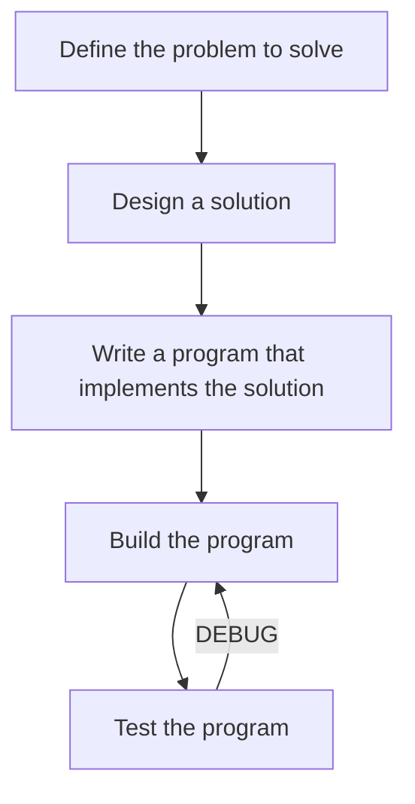

# Workflow
This resource is free and open-source, built entirely on publicly available knowledge. For transparency and further reading, you can find our sources on the [references](/About/references) page.

Its purpose is to provide a structured learning path through the core principles of compiled programming languages, with a focus on both C# (.NET) and C++. While the examples draw from these two languages, many concepts apply broadly across modern compiled languages.

The guide follows a progressive, language-agnostic structure. Topics are introduced in a logical order to build a solid foundation before moving into more advanced material. Where useful, side-by-side comparisons are provided to highlight the similarities and differences between C# and C++.

!!! Warning
    This guide emphasizes depth and clarity. While it is beginner-friendly in tone, the structure may introduce complex ideas early on. If a topic feels overwhelming, take your time—pause, research, experiment, and revisit as needed. That’s how lasting understanding is built.

## Development flow

